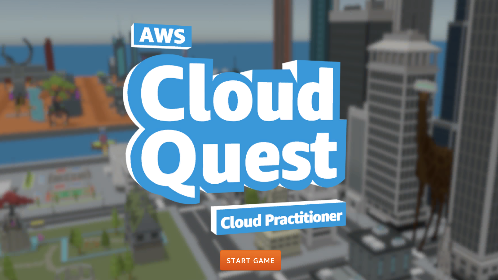
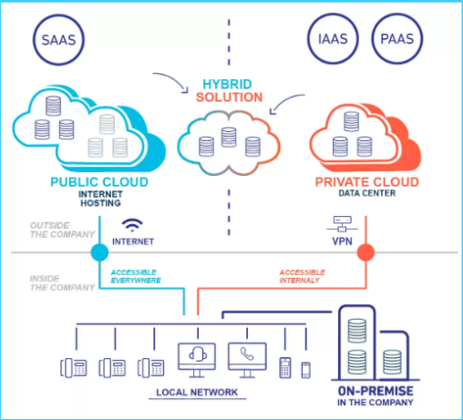
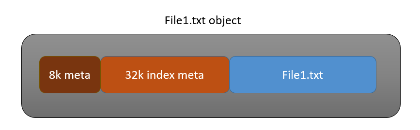
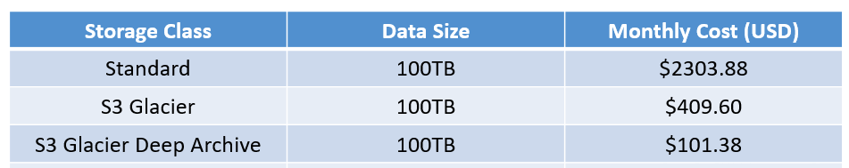
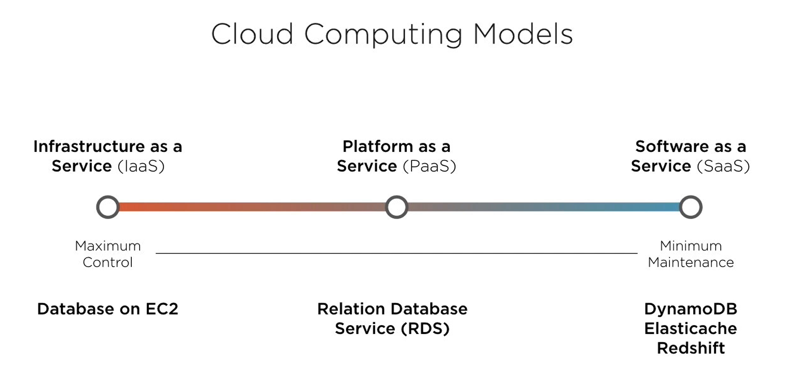
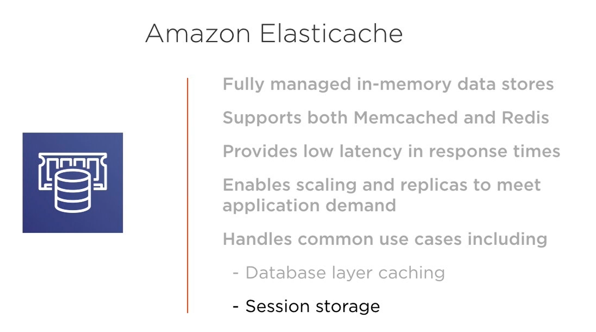
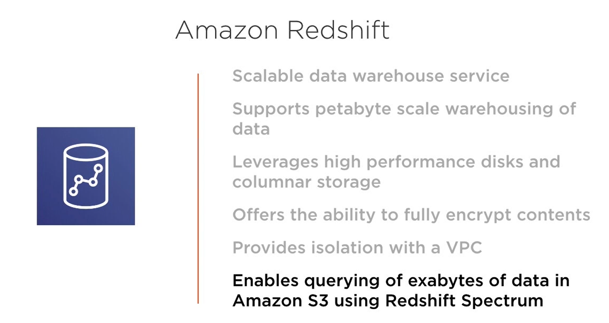
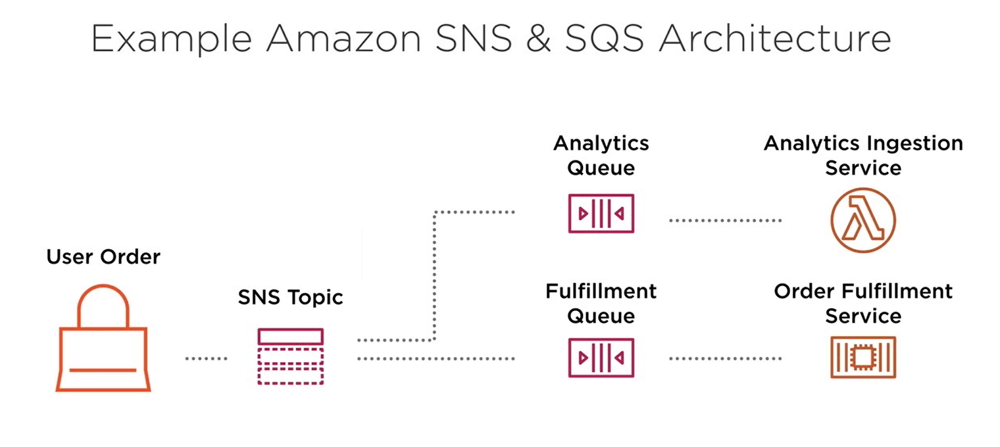

# AWS Bevezetés

## Training360 Videólista
- [NA - Bevezetés az Amazon Cloud lehetőségeibe (classic)](https://e-learning.training360.com/courses/take/na-bevezetes-az-amazon-cloud-lehetosegeibe-classic/lessons/17747244-magas-rendelkezesre-allasu-infrastruktura-tervezese-aws-alapokon-1)
- [NA - Amazon Cloud hálózati infrastruktúra (classic)](https://e-learning.training360.com/courses/take/na-amazon-cloud-halozati-infrastruktura-classic/texts/17745270-bevezeto)
- [NA - Amazon cloud, fájlok a felhőben (classic)](https://e-learning.training360.com/courses/take/na-amazon-cloud-fajlok-a-felhoben-classic/lessons/17745251-1-s3-bevezetes)

## Linkek
2. AWS training [AWS Training](https://www.aws.training/)
3. AWS dokumentáció [AWS Documentation](https://docs.aws.amazon.com/)
4. AWS skillbiulder [AWS Skill Builder](https://explore.skillbuilder.aws/learn)
5. **AWS cloudquest [AWS Cloud Quest: Cloud Practitioner](https://explore.skillbuilder.aws/learn/course/external/view/elearning/11458/aws-cloud-quest-cloud-practitioner)**

## Gyakorló (labor) környezet opciók

### 1. Saját fiók létrehozása:
- Ingyenes regisztráció és 1 év használat (saját account - bankkártya és hiteles adatok szükségesek.)
- Budget Alert beállítása ( mondjuk 10 dollár ) -biztonság kedvéért

### 2. Iskola által biztosított fiók
- Egy szervezet, pl a PROGmasters által biztosított fiók, aminek költségeit az intézmény viseli

### 3. AWS tananyagok - tutorialok, egyenként 3 órás élő AWS fiókkal

- [https://explore.skillbuilder.aws/learn/course/11458/play/42651/play-cloud-quest-cloud-practitioner](https://explore.skillbuilder.aws/learn/course/11458/play/42651/play-cloud-quest-cloud-practitioner)

A SkillBuilder Cloudquest-ből a következőkkel fogunk foglalkozni:
- Cloud Copmuting Essentials
- Cloud First Steps
- Computing Solutions
- Networking Concepts
- Database in Practice
- Auto-healing and scaling applications
- Highly Available Web Application

## Mi a koncepció a felhőszolgáltatások mögött?

### Mit értünk egy adatközpont alatt?

Tegyük fel, hogy közösségi média platformot építünk. Ahhoz, hogy ez működhessen, szükségünk lesz hardverekre/szerverekre, amik ellátnak különböző feladatokat. Például:

- Webszerver: ez fogja kiszolgálni a konkrét weboldalt a felhasználóknak
- Backendszerver: ez fog feldolgozni minden kérést, feladatot, például adatok validálása és mentése adatbázisba
- Adatbázisszerver: itt fogunk tárolni minden felhasználói adatot
- Fájlszerver: itt tárolunk minden egyéb fájlt, például a feltöltött profilképeket

Természetesen ennek felépítésére rengeteg lehetőségünk van. Mindenhol van pro és kontra. De azonnal látható, hogy sok feladatunk van vele, a sok feladat pedig sok hibára ad
lehetőséget.

### Főbb különbségek

- #### Tradicionális adatközpontok

    - Óriási "beugró" költség *(Capitalized Expanditure aka CapEx)*
    - Majd ezután, természetesen, költsége lesz az üzemeltetésnek is, nap-mint-nap fogy az áram stb. *(Operating Expanditure aka OpEx)*
    - Viszonylag kötött a kapacitás, gyakori probléma a feleslegesen nagy, ezért ki nem használt vagy éppen a túl kevés erőforrás.
    - Előre meg kell becsülnünk az erőforrásigényeket, hiszen ezt később körülményes, nehézkes, drága vagy akár lehetetlen lesz bővíteni.
    - Sokkal idő, pénz és erőforrásigényesebb egy ilyet talpra állítani
    - Ezeknek az adatközpontoknak a karbantartása szintén a mi feladatunk. Legyen az hűtés, áramellátás, internethozzáférés, takarítás vagy személyzet.
    - Minden biztonságtechnikai, megfelelőségi ( compliance ) feladat a mi vállunkat nyomja.

- #### Felhőszolgáltatások előnyei ezzel szemben

    - Nincs kezdeti beruházás, használat alapon fizetünk a szolgáltatásokért ( Csak az OpEx-et kell fizetnünk! )
    - Mivel például az AWS nem egy, hanem sok adatközpontot üzemeltet / épít, ezért ő biztos sokkal kedvezőbb áron jut hozzá az erőforrásokhoz, ezért nekünk is elfogadható áron
      tudja ezeket biztosítani.
    - Az erőforrásokat "on-demand" tudjuk igénybe venni. Mindig annyit, amennyire éppen szükségünk van.
    - Az üzemeltetés átkerül a szolgáltatóhoz
    - Akár percek alatt tudunk új adatközpontot létrehozni a világ bármely pontján.

### Skálázás

Többször szó esett már arról, hogyan is tudunk igény esetén több vagy kevesebb erőforrást bevetni. Ezt nevezik skálázásnak, ennek pedig két fajtáját különböztetjük meg:

- Vertikális skálázás

  Meglévő hardver cseréje erősebbre. "Felfelé építkezünk"

- Horizontális skálázás

  Több szerver felhasználása, és sorba állítása. "Terjeszkedünk", hogy több erőforrásunk legyen.

### AWS koncepciók

- ***"Elasticity"*** - Rugalmasság

  Több erőforrást húzhatunk be, ha szükséges, vagy szabadíthatunk fel, ha már nem az. A felhőben erre akár automatikusan is lehetőségünk van

- ***"Reliability"*** - Megbízhatóság

  "The five nines" - Éves szinten 99.999% elérhetőség - Ez azt jelenti, hogy éves szinten maximum 5 perc 15 másodpercig nem lesz elérhető a szolgáltatás. Az AWS törekszik rá,
  hogy a lehető legmegbízhatóbb legyen minden szolgáltatása.

- **"Availability"** - Elérhetőség

  Körülbelül ugyanaz mint az előző, az infrastruktúra kiépítésénél elsődleges szempont a hibatűrés és a rendelkezésre állás

- ***"Agility"*** - Agilitás

  Új ötletek, koncepciók kipróbálása akár percek alatt, nagyon alacsony költségek mellett. Nagyobb fókusz kerülhet a termékünkre és annak fejlesztésére, az infrastruktúra
  üzemeltetése/fejlesztése helyett. Többnyire gyorsabb, egyszerűbb és olcsóbb migráció újabb technológiákra, hardverekre.

---

### Cloud Computing modellek

- **IaaS** - Infrastructure as a Service

  A legnagyobb kontrollt itt kaphatjuk az erőforrásaink felett. Viszont ez igényli a legtöbb üzemeltetési/karbantartási feladatot is.

- **PaaS** - Platform as a Service

  Adott egy platform, amit egy adott módon, adott keretek között testre tudunk szabni. Például egy Wix vagy Wordpress fiók.

- **SaaS** - Software as a Service

  Keveseb kontroll, kevesebb, vagy nulla üzemeltetési/karbantartási feladat. Ide tartozik egyébként egy Facebook vagy GMail fiók is.

---

### Cloud Deployment modellek

- **Publikus felhő (Public cloud)**

  AWS, GCP, Azure (elősorban Paas, SaaS szolgáltatások)

- **Privát felhő (Private cloud)**

  Saját infrastruktúránk egy adatközpontban (Iaas szolgáltatások)  
  *Gyakran csak hálózati beállítások választják el a publikustól*

- **On-Premise**

  Saját infrastruktúránk amihez fizikailag is hozzáférünk.
  
- **Hibrid**

  On-Premise és Cloud szolgáltatások vegyes használata.

  

---

### AWS Infrastruktúra

https://infrastructure.aws

- Regions - Régiók
- Availability Zones - Előrehőségi zónák
- Data Centers - Adatközpontok
- (and Edge Locations) - A site that CloudFront uses to cache copies of your content for faster delivery to users at any location. CloudFront = an AWS CDN (Content Delivery Network)

Minden régió egy konkrét földrajzi helyhez köthető. - Minden ilyen helyhez köthető egy csokornyi adatközpont

Az AWS-nek jelenleg 22 válaszható régiója van. Mindegyik régióban található egy vagy több ***AZ*** (elérhetőségi zóna). Továbbá minden ilyen zónában van egy vagy több adatközpont.
Minden zónának redundáns áramellátása, hálózata van, hogy elkerülhető legyen a "single-point-of-failure". Jelenleg 69 ilyen ***AZ*** létezik világszinten.

Edge Location-ökből kb 200 létezik összesen az AWS-ben, az ő feladatuk az, hogy a lehető legkisebb késleltetéssel tudják kiszolgálni számunkra az AWS szolgáltatásokat. Fontos: ezek
az AWS szolgáltatásokat szolgálják ki nekünk, nem pedig a saját szerverünket. Bár

Pl.:

- Route 53: Az AWS saját DNS szolgáltatása
- CloudFront: Statikus tartalmakat tudunk kiszolgálni ezen keresztül // TODO Ez nem egészen így van, csak nagyjából

---

# AWS Costs

- ## AWS Cost Explorer

    - Rengeteg bontásban megnézhetjük a különböző költségeinket
        - Group By
        - Szűrések
        - Naptár

    - Előrejelzéseket is tud nekünk adni, hogy mennyibe fog kerülni hó végén az infrastruktúra

- ## AWS Budgets

- ## AWS Montly Estimate Calculator

    - Kikalkulálhatjuk mennyibe kerülne egy konkrét infrastruktúra költöztetése a felhőbe
    - Share/Export

- ## AWS Resource Tags

    - Metainformációk csatolása a különböző szolgáltatásokhoz, ezzel például projektenként csoportosítva a költségeket

- ## AWS Organizations

    - Fiókok kezelése egy master fiókból
    - Elszeparálhatóak a költségek szervezet szinten
    - Különböző beállításokat tudunk a master fiókba központosítani

- ## Pricing stratégiák

    - TODO

---

# AWS Support Plans

AWS fizetős támogatási szolgáltatásai.
[https://aws.amazon.com/premiumsupport/plans/](https://aws.amazon.com/premiumsupport/plans/)

- Support Plan Tiers
- Support Tools
- Trusted Advisor
- AWS Health Dashboard

---

# AWS Erőforrások kezelése
azaz hogyan és milyen felültről használjuk az AWS-t?

### 1. AWS Console

Böngészőből elérhető AWS felület és funkciók

### 2. AWS CLI

Command line / Terminálból elérhető AWS funkciók (bővebb, mint a böngészős verzió)

- Külön kell telepíteni
- Access key létrehozása
    - root userhez sose csináljunk!
    - Profil Név -> Security Credentials -> Access keys -> Create new access keys

### 3. AWS SDK

Különböző programnyelvekhez írt könyvtár segítségével tudjuk kezelni az erőforrásokat.

---

# AWS Szolgáltatások kategóriák szerint

Felhasználási szempontból nagyobb kategóriákra bonthatjuk az AWS szolgáltatásait. A teljesség igénye nélkül nézzük meg néhány fontosabbat.

### Amazon S3

Egy *core* szolgáltatás az AWS-en. Segítségével lehetőségünk van fájlokat tárolni a felhőben, úgynevezett ***bucket***-okban.

Felhasználástól függően különböző beállítások tartozhatnak minden egyes ilyen buckethoz.

Ami szuper benne, hogy közvetlen URL-t kaphatunk az egyes fájlokhoz. Így például könnyedén megoszthatunk egy fájlt valakivel, ha megfelelően van felkonfigurálva.

#### **Storage Classok** - Ehhez a tárhelyhez különböző osztályok tartozhatnak

- S3 Standard - Ez a default. A gyakran lekérdezett fájlokhoz a legcélszerűbb.
- S3 Intelligent Tiering - Ez felhasználástól függően fogja a tárhelyet a különböző osztályokba pakolni.
- S3 Standard IA - A ritkán lekért adatokhoz, több AZ-ban is elérhetőek ezek az adatok, olcsóbb.
- S3 One Zone IA - Szintén a ritkán lekért adatokhoz, egyetlen AZ-ban érhetőek el az adatok, sokkal olcsóbb.

#### **S3 Lifecycle Policies**

- Egy bucketban lévő fájlok "lejárhatnak" vagy átkerülhetnek máshová bizonyos feltételek hatására
- Így akár fájl szinten is tudunk mozgatni storage-classok között
- A lejáratással akár törölhetünk is fájlokat
- Lehetőségünk van akár verziózni is a fájljainkat, és ehhez is köthetünk például lejáratot.

#### Webhosting S3 segítségével

- Létrehozunk egy S3 bucketet
- Feltöltjük a fájljainkat
- Megpróbáljuk elérni a fájlokat az S3-as URL segítségével
- Felkonfiguráljuk a bucket-et webhostinghoz

---

### Glacier

Ez egy újabb Storage Class S3 alatt, elsősorban adatokhoz.
AWS nem erősíti meg, de itt lehet arra gondolni, hogy szalagra mentik az adatokat, hasonlóan a régi magnókazetták mágnesszalagjaira.

Konfigurálhatjuk mennyire gyorsan szeretnénk elérni az itt található adatokat. Lassabb elérési idő -> alacsonyabb költségek.

Áthelyezhetünk ide fájlokat kézzel, vagy az S3 Lifecycle policyket kiaknázva.

Két fajtája van:

- S3 Glacier

  Minimum 90 napra kell allokálni ide fájlokat. Ezek elérhetőek akár perceken vagy órákon belül. A tárolásért sokkal kevesebbet fizetünk, viszont az innen kiolvasott adatmennyiség alapján szintén fizetnünk kell. Az S3 Standard classhoz képest kevesebb mint az ötödébe fog kerülni.

- S3 Glacier Deep Archive

  Minimum 180 napra kell allokállni a fájlokat. A fájlok elérése legalább órákba telik. Az árazás ugyanúgy működik mint a Glaciernél, csak jóval olcsóbb a tárhely. Az S3 Standarhez képest kevesebb mint 1/23-ába fog kerülni a tárhely.

  > You should be aware that data stored in the S3 Glacier Deep Archive storage class has a minimum storage duration period of 180 days and a default retrieval time of <=12 hours. If you have deleted, overwritten or transitioned to a different storage class before the 180-day minimum, you are charged for 180 days anyway.
  >
  > - For each object you archive to Amazon S3 Glacier or S3 Glacier Deep Archive, Amazon S3 uses 8 KB of storage for the object name and other metadata. Amazon S3 stores this metadata so that you can get a real-time list of your archived objects by using the Amazon S3 API. You are charged S3 Standard rates for this additional storage.
  > - For each object that is archived to Amazon S3 Glacier or S3 Glacier Deep Archive, Amazon S3 also adds 32 KB of storage for index and related metadata. This extra data is necessary to identify and restore your object. You are charged Amazon S3 Glacier or S3 Glacier Deep Archive rates for this additional storage.
  >
  > 
  >
  > So if your S3 bucket contains a large number of small objects, you should consider these additional storage charges.

Összehasonlításképp, a költségek a különböző classokban:

---

---

## Compute Services - VM-ek a felhőben

### EC2 - IaaS - Virtuális gépek

Rengeteg különböző felhasználása lehet. Itt egy konkrét virtuális gépet kapunk a felhőben, amire kedvünkre telepíthetünk amit szeretnénk. Legyen az adatbázis, webszerver, backend
alkalmazás.

#### Instance típusok

Ez meghatároz egy konkrét hardver specifikációt. Pl.: processzor, memória, tárhely. Leállított állapotban módosítható. Elérhetőek különböző felhasználási feladatokra optimalizált
változatok is, pl.: számításra, memórihasználatra vagy fájlkezelésre optimalizált gépek, vagy akár GPU-t is kaphatunk a gépünkbe.

Az instance-ek árazása elsősorban ezek függvényében fog változni.

##### Root Device Types

**Instance Store** - A virtuális gépünk tárhelye hozzá van csatolva a géphez. Ez röviden annyit jelent, hogyha végleg lekapcsoljuk a gépünket, akkor minden adat el fog veszni róla

**Elastic Block Store (EBS)** - A tárhely elkülönítve létezik, "független" a virtuális géptől

#### **AMI - Amazon Machine Image**

Egy sablon ami tartalmazza a virtuális gép minden adatát: konfiguráció, OS, adatok.

Az AWS oldalán renegeteg ilyen sablont találunk (ingyenes + fizetős), elég sok use-case-t lefednek, amik alapján könnyedén indíthatunk egy konkrét feladathoz szükséges gépet.

#### Purchese Options

- **On-Demand**

  Ez az alap

- **Reserved**

  Elköteleződünk, hogy fix ideig (1-3év) használni fogjuk azt a bizonyos instancet, ezáltal olcsóbbá válik. Nincs "játék" az erőforrással, a lefoglalt hardver mindig rendelkezésre
  fog állni.

    - Standard / Convertible / Scheduled
    - A fizetéssel is lehet spórolni, ha pl előre rendezzük.

- **Savings Plan**

  Hasonló mint a Reserved, itt viszont nem foglalja le fixen a hardvert.

    - Akár 72%-os megtakarítás is elérhető

- **Spot**

  A teljesítmény felesleget mások rendelkezésére tudjuk bocsájtani, vagy leállítani a gépet, ha nincs rá igény.

    - Akár 90%-ot spórolhatunk

- **Dedicated**

  A legdrágább opció, itt konkrét fizikai gépet kapunk. Erre szükségünk lehet pl. különböző compliance vagy biztonsági előírások miatt.

#### Hands-On - Indítsunk saját EC2-t!

---

### AWS Elastic Beanstalk - PaaS

Kvázi egy wrappert ad az EC2 köré, kivesz némi konfigurációs lehetőséget a kezünkből, viszont sok minden mást képes automatizáltan megcsinálni helyettünk, pl.: Monitoring, Health
Check

#### Hands-On - Indítsunk saját EBS-t!

---

### AWS Lambda

Képesek vagyunk kódot futtatni vele, erőforrások és infrastruktúra lefoglalása nélkül. Csak a felhasznált számítási teljesítményért fizetünk. Csak amikor éppen szükséges. Remek
integrációja van a többi AWS szolgáltatással. Az elsődleges megoldás szolgáltatás a serverless architektúrában (Erről később)

---
## File Storeage Services

---

### Elastic Block Store - EBS

EC2 instancekhez való csatoláshoz van tervezve. Akár több petabytenyi adatot is képesek vagyunk tárolni.

Lehetőségünk van:

- Pillanatképeket készíteni az állapotáról.
- Adatok titkosítására
- Többféle kötetet tudunk használni (SSD, IOPS SSD, HDD)

---

### Elastic File System - EFS

- NFS fájlrendszer
- Linux rendszerekhez tervezve
- Storage Classok
    - Standard
    - Infrequent access
- Akár több EC2 instancehez is felcsatolható

---

### AWS Snowball

Röviden és zanzásítva: Az AWS kihoz egy winchestert neked az irodához, rárakod az adatokat, visszaküldeted velük, ők pedig feltöltik neked S3-ra. Csak peta/exabytenyi adatnál használatos. ~300$-tól indul a szolgáltatás, ez a "kiszállási díj"

---

## Networking & Content Delivery Services

---

### Amazon Route 53

Az Amazon DNS szolgáltatása.

- Global Resource Routing - Lehetőségünk van például beállítani, hogy egy domain címet ahhoz a szerverhez irányítson, ami földrajzilag a legközelebb van a felhasználóhoz.

- Megadhatunk tartalék IP címet, ha például az elsődleges nem válaszol.

---

### Amazon VPC

Virtuális, publikus és magánhálózatokat hozhatunk létre. Támogatja az IPv4 és IPv6 szabványokat egyaránt. Igénybe vehetünk NAT szolgáltatásokat.

Felkonfigurálhatunk benne:

- Subnetet, alhálózatokat
- IP address ranget, IP cím tartományt
- Route tables, Route táblákat
- Network Gatewayeket, Hálózati átjárokat

Nagy hasznunkra válhat, hiszen hozzá csatolhatjuk például egy külső adatközpontunkat és a belső AWS szolgáltatásainkat egyaránt.

---

### AWS Direct Connect

[AWS Direct Connect](https://docs.aws.amazon.com/directconnect/latest/UserGuide/Welcome.html)

Ennek a segítségével lehetőségünk van közvetlen hálózati kapcsolatot kiépíteni egy AWS szolgáltatás és egy AWS-től független adatközponttal

---

### Amazon API Gateway

Az API-jainkat tudjuk vele publikálni más alkalmazások számára.

- Közvetlenül integrálódik több AWS szolgáltatással.
- Monitorozási és metrikai adatok az API hívásokról.

---

### Amazon CloudFront

Content Delivery Network - CDN

- A felhasználó a hozzá legközelebb eső szerverről fogja megkapni a kért adatokat.
- Támogatja a statikus és dinamikus adatok kiszolgálását egyaránt.
- Az AWS Edge Location-jeit aknázza ki erre a célra
- Tartalmaz különböző biztonsági szolgáltatásokat, pl.:
    - AWS Shield, DDoS támadások ellen
    - AWS WAF - Web Application Firewall

---

### Elastic Load Balancig - ELB

Dinamikus terhelés elosztást tesz lehetővé az erőforrásaink között.

Remekül integrálódik az EC2, ECS és Lambda szolgáltatásokkal.

Egy régión belül, akár több AZ-t is képes kezelni.

Három fajtája van:

- Application Load Balancer (ALB)
- Network Load Balancer (NLB)
- Classic Load Balancer

---

## Database Services

---

### Amazon Relational Database Service - RDS

- Teljeskörű szolgáltatás adatbázis kezeléshez.
- Rengeteg felmerülő problémára ad out-of-the-box megoldást, mint például biztonsági másolat készítés, helyreállítás, provisioning.
- Több különböző AZ-be deployolhatjuk.
- "Read replica"-kat készíthetünk, ez jó lehet például terhelés elosztásra.
- VPC-be kerül automatikusan
- Használhatunk SSD-t vagy IOPS SSD-t.
- Sokféle különböző platformot támogat, mint pl.: MySQL, PostgreSQL, MariaDb, Oracle SQL, SQL Server és...

**...Amazon Aurora**

Ez egy MySQL és PostgreSQL kompatibilis platform, dedikáltan az RDS-hez készítve.

**Amazon DMS - Database Migration Service**

Segítségével migrálhatjuk a meglévő adatbázisunkat a felhőbe.

---

### Dynamo DB

- Teljeskörű NoSQL adatbázis szolgáltatás

---

### Elasticache and Redshift

---

## App Integration Services

---

### AWS Messaging Services

#### Amazon SNS - Simple Notification Service

Publish/Subscribe megközelítéssel tudunk adatokat továbbítani.

Lehetőségünk van akár SMS-ekett, emaileket vagy push notificationöket küldeni.

Fontos, ha küldünk egy üzenetet, de senki sincs feliratkozva rá, akkor az az üzenet elvész.

#### Amazon SQS - Simple Queue Service

Maximum 256kb adatot tudunk rajta keresztül továbbítani, és ezek az üzenetek akár 14 napig is ott lehetnek a "csőben"

Két fajtája van:

- Standard - Az üzenetek sorrendje nem garantált.
- FIFO - First in - First out

### AWS Step Functions

Egy remek szolgáltatás a serverless architektúra kiaknázására.

---

## Management

### CloudTrail - Account audit log

Segítségével monitorozhatjuk és visszanézhetjük az összes szervezeten belüli felhasználó tevékenységét. Legyen az a tevékenység az AWS Console-on, CLI-n vagy SDK-n keresztül.

### CloudWatch - Resource logok és metrikák aggregálása

Létrehozhatunk az adatok alapján riasztásokat, dashboardokat.

### AWS Config

Monitorozza és rögzíti, verziózva a teljes AWS infrastruktúránk konfigurációját.

### System Manager - Resource management automatizáció

Ad egy csokor eszközt a kezünkbe, hogy kezelhessük az AWS szolgáltatásainkat.

Lehetőséget ad feladatok autmatizálására.

### CloudFormation - Infrastructure as Code

Segítségével templateből (yaml vagy json) lehet felhúzni resourceokat.

### AWS Organizations - AWS Control Tower - alfiókok kezelése

# Security

## IAM

## Amazon Cognito

# Networking

### Kulcsszavak
1) Kötlező tutoriáliok (8db):
https://cloudquest.skillbuilder.aws/
 - Cloud Computing Essentials
 - Cloud First Steps
 - Computing Solutions
 - Networking Concepts
 - Database in Practice
 - File System in the Cloud
 - Auto-healing and scaling applications
 - Core Security Concepts

2) General AWS concepts (5)
- Region
- AZ
- Data center
- Tags (key-value pairs)
- IAM users
- IaaS, PaaS, SaaS

3) EC2 (5)
  - Instance
  - Security Group
  - Instance type (t2.micro: 1vCPU, 1GB RAM)
  - AMI: Amazon Machine Image
  - Auto scaling, healing

4) Network concepts (5)
 - VPC
 - Subnet
 - Routes table
 - Route53 (DNS)
 - Security group, Ports

5) Storage: EFS, ESB S3 (5)
- S3 simple storage service
    - Bucket - obejktum : data - metadata
    - Glacier
- EBS: Elastic Block Store (per instance)
- EFS: Elastic File System (multiple instance, diamikus méretű)
- CloudFront (CDN) - Edge Location-ökre menti az objektumokat

6) Databases(5)
- RDS
- NoSQL
- Multi-AZ
- Replica (Standby db)

