# Konfigurálás, telepítés

[Telepítés](./docker-install.md)

Bevezetés
=========

Mi az a Docker és miért jó?
---------------------------

> *A Docker egy olyan virtualizációs platform, amely alkalmazások konténerekben való fejlesztésére, szállítására és futtatására szolgál.*

### Mi az a virtualizáció?

Röviden összefoglalva abban az esetben beszélhetünk virtualizációról, amikor egy hardveren több (virtuális) rendszer működik egyszerre, virtuális gépekben futó, önálló operációs
rendszerekben.

#### Miért jó, mire jó a virtualizáció?

A jelenleg elérhető szerver hardverek kapacitása sok esetben meghaladja a hardverre telepített rendszer erőforrás igényét. A kiemelt célrendszerektől eltekintve szinte valamennyi
rendszeren marad fel nem használt kapacitás, de még célrendszerek esetén is előfordul, hogy a nagy terhelés csak időszakosan jelentkezik, és a fennmaradó időben az eszköz
kapacitása kihasználatlan marad. A virtualizáció ezeket a szabad kapacitásokat célozza meg. A korábbi “egy rendszer, egy hardver” modell helyett a rendszereket kellően erős
hardverre vonja össze, és ennek az eszköznek az erőforrásait osztja el virtuális gépek formájában az egyes rendszerek között, így alkotva optimálisan kihasznált, ebből eredően
költséghatékony megoldást.

A virtualizációval járó összevonás egyik járulékos előnye, hogy a virtuális hardver egyfajta szabvány hardverfelületet biztosít az üzemeltetők számára, megkímélve őket a hardver
upgrade során felmerülő kompatibilitási, frissítési, illetve kiesési problémáktól.

### Mi az a konténerizáció?

- Míg a virtualizációnál közvetlen a hardvert osztjuk meg, itt ennek az erőforrások kiosztását egy már élő operációs rendszeren futó, konténer "motor" osztja el.
- A konténereknek nincsen saját operációs rendszerük, a szülő operációs rendszerre építenek.
    - Ez lehet egyaránt Windows és Linux alapú rendszer
    - Fun fact: Windows alatt használhatunk WSL-t vagy virtualizációt ( Hyper-V ), hogy Linuxos konténereket futtassunk. Linuxon viszont nem lehet Windowsosat

- A konténerek hihetetlenül pehelysúlyúak, indításuk/kezelésük időben és erőforrásban mindössze töredéke a virtuális gépekének


- [*How is Docker different from a virtual machine?*](https://stackoverflow.com/questions/16047306/how-is-docker-different-from-a-virtual-machine)

### Fejlesztés, szállítás, futtatás?

- Fejlesztés alatt álló kódunknak fix környezetet tudunk biztosítani
- Szállítás során, fix környezet az, ami a forráskódunkból gépikódot, vagy egyéb produktumot tud generálni
- Futtatás során fix környezetben tud élni/futni a termék

### A konténerizáció előnyei

- Izolált, "dobozolt" környezetben tudunk futtatni alkalmazásokat, rendszereket
    - Az alkalmazás elkülönül az infrastruktúrától (konténer = izolált környezet)

- Lightweight. Eldobható, gyorsan indítható, leállítható
    - Az erőforrásigények, akár megabájtban, akár hardverben, egy komplett virtuális géphez képest elenyészőek

    - Egy konténer pillanatok alatt elindítható. Egy virtuális gép felhúzása ellenben legjobb esetben is minimum percekbe telik.

- "But it runs on my machine!!" - Infrastructure as code
    - Konténerizált alkalmazás bárhol futtatható, nincs "az én gépemen működik" probléma

### A konténerizáció hátrányai, virtualizációval szemben

- Nem egy "silver-bullet" minden esetre, problémára. Pl.: monolith alkalmazásoknál célszerűbb lehet a virtualizációt használni.
- Ehhez kapcsolódva, előfordulhat, hogy egy VM alatt egyszerűbb lehet egy tipikus OS + infrastruktúra + konfiguráció szentháromságba elhelyezni az alkalmazásunkat, mint megkeresni
  a megfelelő építő kockákat a konténeres világban.
- Alacsonyabb szintű izoláció VM-hez képet. Ugyanazon a kernelen, OS-en osztoznak a konténerek.
- Hajlamosabbak "elburjánzani". Mivel az indításuk, skálázásuk jóval egyszerűbb és kézenfekvőbb, könnyen megeshet, hogy végül több erőforrást szívnak fel.

**A Docker csak egy, a platformok közül. Néhány alternatíva:** [*6 Docker Alternatives and Other Types of Container
Tools*](https://jfrog.com/knowledge-base/6-alternatives-to-docker-all-in-one-solutions-and-standalone-container-tools/)

Docker ökoszisztéma
-------------------

​    **Docker Hub:** hivatalos és nem hivatalos képfájlok forrása, nyilvános és private registry is lehet

​    **Docker Desktop:** Kliens alkalmazás, Docker kezeléséhez felhasználói felület

​    **Docker Compose:** Több komponensből álló alkalmazások összeállítása

​    **Docker Machine/Swarm:** Skálázás és távoli menedzsment

​    **Kubernetes (aka. K8):** Konténerizációs koncepciókra épít, segítségével lehetőségünk van konténer orkesztrációra. Leegyszerűsítve, sok konténert, és az ő kapcsolatukat,
skálázásukat tudjuk általa kezelni.

Szakmai zsargon
---------------

**Image**

- Tekinthetünk rá egy statikus (csak olvasható) sablonként/templateként. Ezekből tudunk létrehozni/indítani konténereket. Rengeteg bázis image áll rendelkezésünkre, amik
  ‘out-of-the-box’ működőképesek.

> [*Docker Hub*](https://hub.docker.com/)

- Amiket egy image tartalmaz

    - OS fájlokat, objektumokat

    - Applikációhoz tartozó fájlokat

    - "Manifest" - Leírás ezek kapcsolódásáról

**Konténer**

- Az image felhasználásával indított példány az alkalmazásból

- Itt már kapunk egy írható/olvasható réteget is. (A rétegekről később) Ezáltal a konténerek tartalma már képes változni

**Docker Engine**

- Egy szolgáltatás, daemon. Ő kezeli az image-ket és a konténereket

“The Low-level stuff”
=====================

A konténerizációs technológiák, már jóval a Docker megjelenése előtt is léteztek és használták ezeket. Erre a Linux "primitívjeit" használták, ahol kézzel kellett konfigurálni a
konténer izolációjához szükséges erőforrásokat.

**Névterek - namespaces**  
Ezek segítségével megoldható, hogy a globális rendszererőforrások egy bizonyos folyamathoz legyenek allokálva.

- **Folyamatazonosító**: Mikor létrehozunk egy ilyen névteret, egy folyamattal, a névtéren belül ez a folyamat 1-es azonosítót fogja kapni, ő lesz az úgynevezett root process. A
  konténeren kívülről viszont ennek biztosan valami eltérő azonosítója lesz.
- **Hálózat**: Ezek a névterek teljesen önálló/izolált hálózattal is rendelkeznek, ők úgy fogják látni, hogy egy saját, dedikált hálózati interfészük van.
- **Fájlrendszer**: Biztosítunk egy, csak a konténer számára elérhető fájlrendszert, amit ő szintén a sajátjának lát belülről.
- **Felhasználó**: Szintén teljesen egyedi felhasználónk és felhasználói csoportunk van.

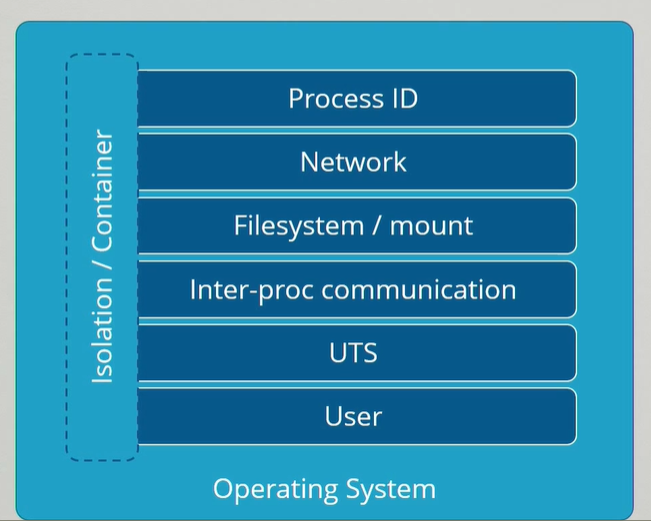

**Control Groups - cGroups**  
Erőforrások allokálása és korlátok meghatározása a konténerekhez. Konténer szinten beállíthatunk használati korlátokat, mint például memória, processzoridő.

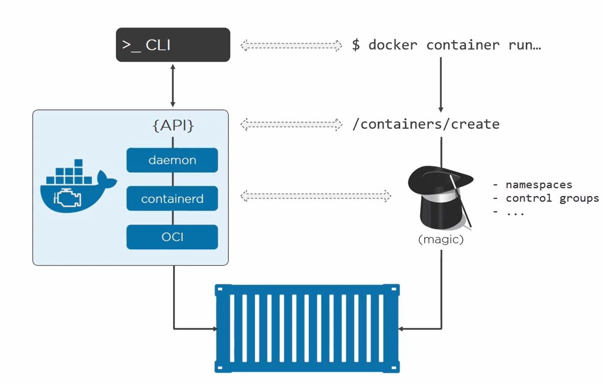

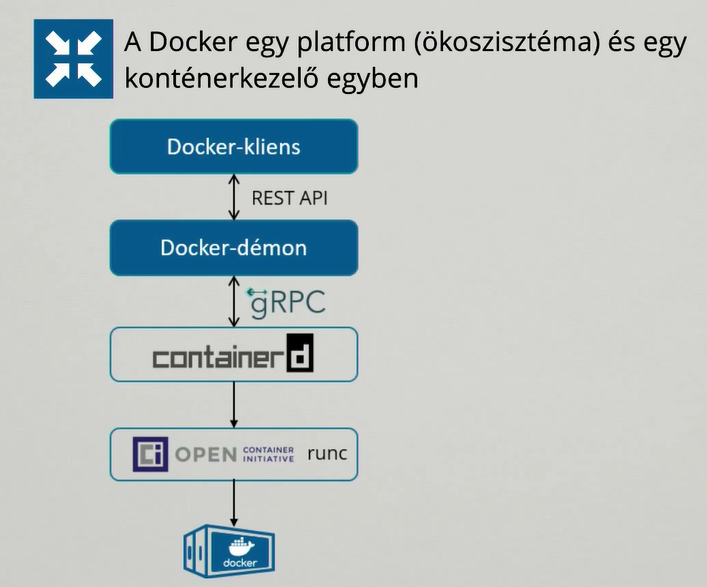

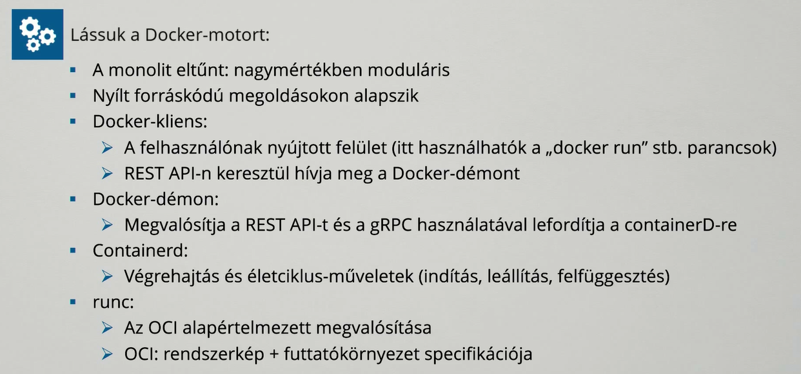

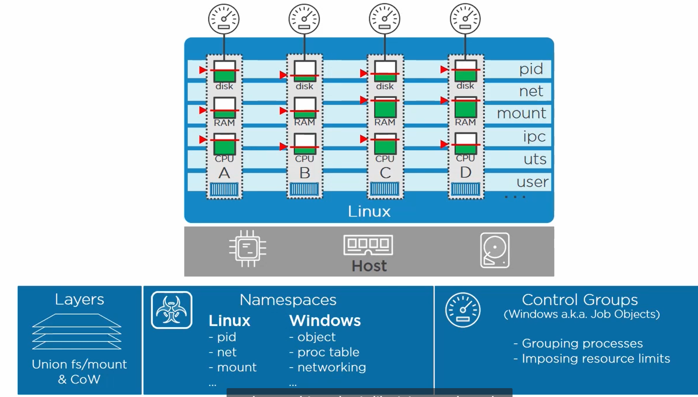

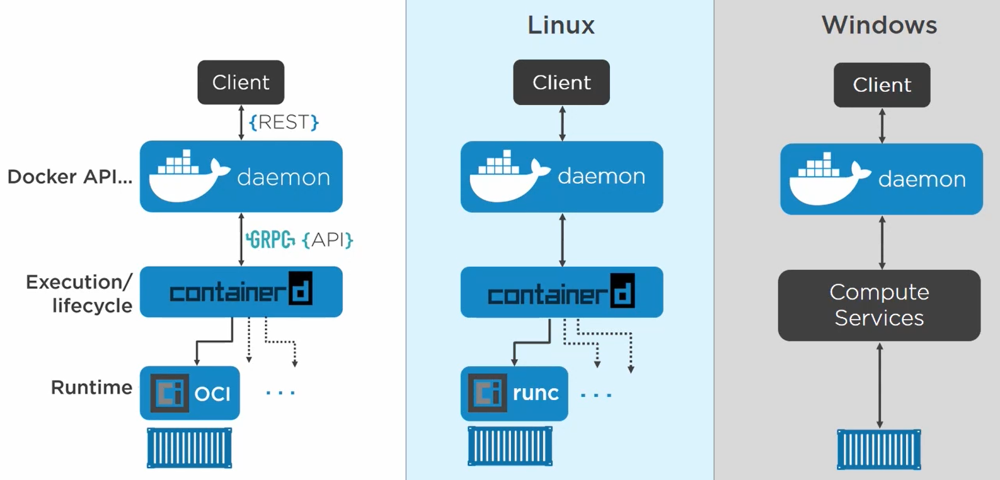


Hello ~~World~~ Docker!
=======================

[*Docker*](https://www.docker.com/)

Docker változatok
-----------------

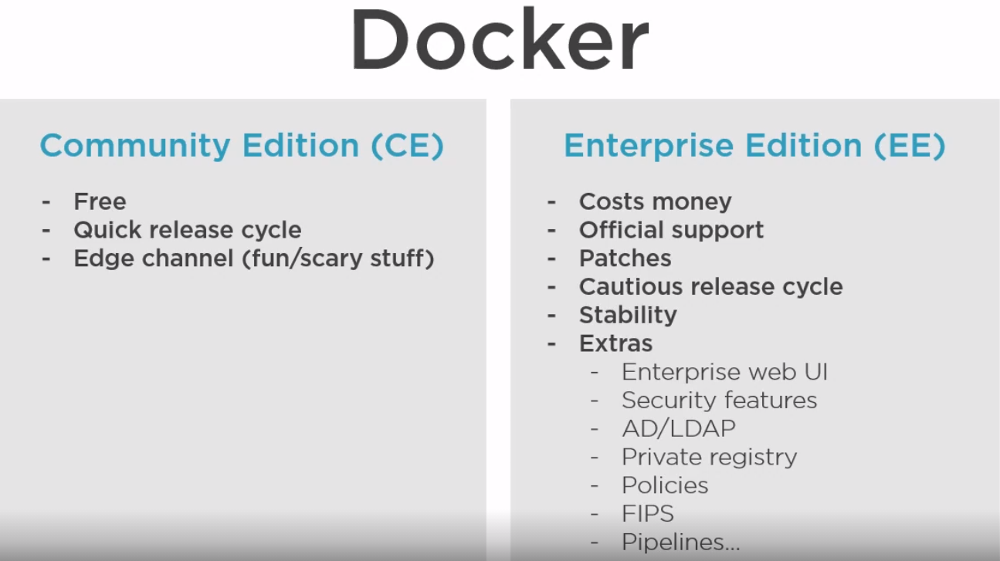

Mielőtt belevágunk az alábbi két paranccsal ellenőrizhetjük, hogy elérjük-e a dockerünket
-----------------------------------------------------------------------------------------

- `**docker version**`
    - Docker verzió

- **`docker info`**
    - Részletes információk

- **`docker stats`**
- docker erőforrás monitorozás

Miután telepítettük a Dockert a gépünkre, terminálból adjuk ki az alábbi parancsot:
-----------------------------------------------------------------------------------

- **`docker run hello-world`**
- **Ha Linuxon nem akar sudo-nélkül működni, adjuk hozzá az aktuális userünket a ‘docker’ user-grouphoz**
    - **`sudo adduser ubuntu docker`**

        - Ezután mindenképpen kelleni fog egy login/logout, esetenként egy reboot. Viszont ha mindent jól csináltunk, nem lesz szükségünk a sudo parancsra.

Azon kívül, hogy egy csomó minden kiíródott a konzolra, nem sok minden történt látszólag. A háttérben viszont rengeteg folyamat lezajlott:

- A Docker megnézte, hogy a *hello-world* image-ből található-e letöltve példány
- Mivel nem talált (még hozzá *:latest* taggel, erről később) ezért letöltötte a Docker Repositoryból, alapértelmezetten a DockerHub-ról
- Létrehozott az imageből egy konténert
- Elindította a konténert, amit elindítva visszaadott nekünk a konzolra egy hosszú üzenetet
- Leállította a konténert

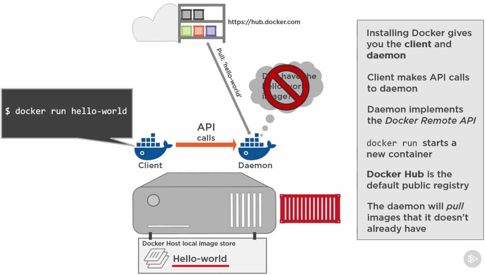

**Ellenőrizhetjük ezeket, a következő parancsokkal:**

- ***`docker image ls`***
    - kilistázhatjuk a gépen lévő imageket

- `docker image rm`
- `docker image prune`
- `docker ps`
    - ez kilistázza az összes **futó** konténerünket jelen esetben ez nem fog semmit listázni, hiszen a konténer le is állt
    - `docker ps -a`
        - ezzel a futó konténereken felül a leállított/leállt szintén kilistázhatjuk

**Töröljük a létrehozott konténert, és imaget**

- `docker rmi <image-name:tag> / `
    - image törlése
- `docker rmi $(docker image ls -q)`
    - ÖSSZES “dangling” image törlése

- `docker rm <container-name> / <container-id>`
    - konténer törlése

- `docker rm $(docker ps -aq)`
    - ÖSSZES konténer törlése:

- `docker rm -f $(docker ps -aq)`
    - A jelenleg futó konténerek IS

Image-ek további kezelése
-------------------------

- `docker search nginx`
    - Imagek keresése
    - Sajnos tag-ekra nincs lehetőségünk szűrni, listázni őket (az írás pillanatában)

- `docker image pull <image-name:image-tag>`
    - A DockerHub-ról / repositoryból / registryből tudunk lehúzni tetszőleges imageket

    - Fontos, hogy csak azért, mert az van odaírva, hogy *latest*, az az image még nem feltétlenül a legfrissebb verziót tartalmazza, amennyiben ez nincs konzisztensen kezelve a
      felhőben és/vagy a gépünkön!

    - Jó tanácsok:
        - Amennyiben lehet, mindig ***official*** imageket használjunk

        - Ha valamelyik alkalmazásból nincs base-image, és kénytelenek vagyunk sajátot készíteni, akkor egy official-t vegyünk alapul

        - Kerüljük a *:latest* tag használatát, használjunk explicit verziószámokat
    - Amit letöltésnél érdemes megnézni, az a letöltés folyamata:

> 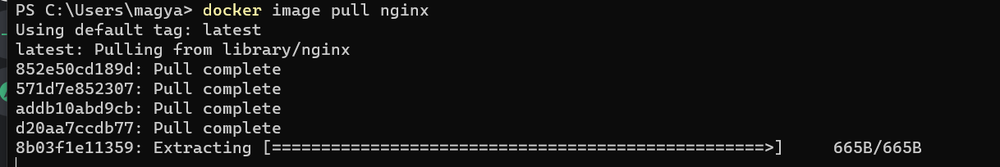
>
> Itt a különböző sorok, különböző rétegeket jelölnek az image-n belül. Ezek a rétegek egymás tetejére épülnek, és különböző fájlokat tartalmaznak, amik meghatározzák, hogy pontosan miből is fog végül felépülni az imageünk.
>
> Valahogy így:
>
> 

- `docker image inspect <image-name:image-tag>`
    - Bővebb információk lekérése imageről

## Fájlrendszer működése

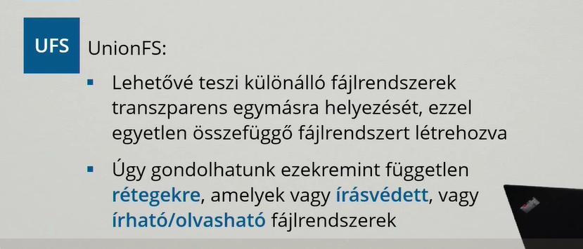

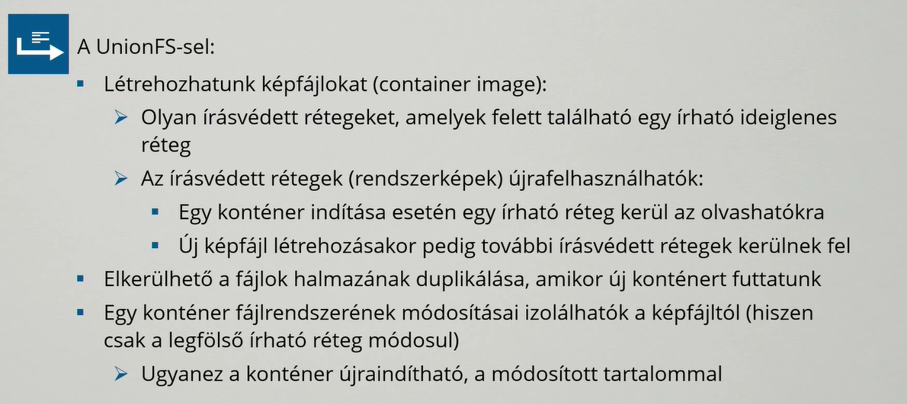

## Gyakorló feladatok

1. Keress egy _official_ MySQL image-t a _hub.docker.com_-ról
2. Írd meg a parancsot, ami letölt belőle egy konkrét verziót
3. Írd meg a parancsot, ami ebből indít egy példányt
4. Írd meg a parancsot, ami leállítja, majd letörli ezt a konténert
5. Írd meg a parancsot, ami letörli a hozzá tartozó imaget
    1. Név alapján
    2. Id alapján

# Hozzunk létre saját Docker imaget!

[*Dockerfile reference | Docker Documentation*](https://docs.docker.com/engine/reference/builder/)

Hogyan is néz ki ez a gyakorlatban?

1. Szükségünk lesz, egy már működő alkalmazásra (my-server.jar) ✅

2. Készítünk egy *Dockerfile* nevű fájlt, ez fogja leírni, hogyan épül fel az image-ünk

3. Létrehozzuk a fájlból az imaget

4. Elindítjuk a saját image-ünkből a konténert

5. (Opcionális) Jelentkezzünk be a hub.docker.com-ra CLI-ből. Szükségünk lesz egy már létező Docker felhasználói fiókra.

6. (Opcionális) Publikáljuk a saját name-spaceünkbe az imaget

1\. Az alábbi java szerverünket fogjuk használni: [*my-server,jar*](./custom-image/my-server.jar)

2\. A Dockerfile egy egyszerű szöveges fájl, egy saját szintaxissal, ami megmondja, hogy egy image-nek hogyan kell felépülnie. **Note: A fájlnév is fontos!**

- Hozzuk létre a fájlt. `touch Dockerfile`
- Majd másoljuk be a következő snippetet

```dockerfile
FROM openjdk:11.0.9.1-jre
LABEL maintainer="work@email.address"
RUN mkdir /app
COPY ./my-server.jar /app
WORKDIR /app
EXPOSE 8080
ENTRYPOINT ["java","-jar","./my-server.jar"]
```

3\. Futtassuk az alábbi parancsot:

- `docker image build -t my-name-java-app:0.0.1 .`
    - Ezzel készítünk a leíró Dockerfile-ból, egy használható imaget

    - **‘-t’** - egyedi nevet adhatunk a létrehozandó imagenek

    - **‘ . ‘** - a parancs végén a pont arra utal, hogy milyen kontextust használjon az image építése közben. A fájlban lévő útvonalak ezekhez képest lesznek relatívak.
    - Fontos, hogy ebben az esetben nem fogjuk tudni publikálni az imaget, ahhoz, hogy ez működjön meg kell adni az image nevében, hogy melyik name-space alá akarjuk hogy kerüljön:
        - `docker image build -t my-docker-username/my-name-java-app:0.0.1 .`

4\. Indítsuk el az image-ből a konténert:

- `docker run -d -p 4001:8080 my-name-java-app:0.0.1`
    - **‘-d’** - kapcsolóval szervízként/daemon-ként indítjuk a konténert --> háttérben
    - **‘-p’** - kapcsolóval tudunk nyitni a világ felé portokat
        - port-forwarding-ként működik

5\. Bejelentkezés

- `docker login -u username docker.io`

- Ez szükséges ahhoz, hogy publikálhassuk a saját docker felhasználónk alá

6\. Publikálás

- `docker image push my-username/my-name-java-app:0.0.1`

Dockerfile
----------

- **FROM**

    - **FROM openjdk:11.0.13-jre-slim-buster**

    - Megadhatjuk vele, hogy melyik bázis imaget használjuk

- **LABEL**

    - **LABEL maintainer="magyar.attila@qtc-kft.com"**

    - Meta-információkat adhatunk meg az imagehez, opcionális

- **RUN**
    - **RUN \["mkdir", "/app"\]**

    - **RUN mkdir /app**

    - Parancssorból futtathatunk parancsokat

- **COPY** vs. **ADD**
    - **COPY ./\*html /usr/share/nginx/html**

    - ADD a régebbi, némileg több funkcionalitással bír, például másolás http-n keresztül. Mégis a COPY a javasolt parancs, hacsak nem indokolt az ADD.

- **EXPOSE**
- **EXPOSE 80**
- **EXPOSE 80/tcp**

- Megadhatjuk, hogy milyen portokat szeretnénk kinyitni a világ felé, nem szolgál különösebb funkcionalitással, elsősorban inkább dokumentálja a működést.


- **ARG**
    - **ARG my_arg**
    - Előre definiálhatunk vele változó neveket, ha itt nem adunk meg default értéket, akkor a build során hibát fogunk kapni.

- **ENV**
    - **ENV MY\_VAR=my-value**

    - Különböző környezeti változókat állíthatunk be

- **ENTRYPOINT** vs. **CMD**
    - **ENTRYPOINT \["/entrypoint.sh"\]**
        - **ENTRYPOINT** mindeképpen le fog futni a konténer indulásakor, hacsak `--entry-point` kapcsolóval felül nem írjuk

    - **CMD \["echo","hello world!"\]**
        - Ez a parancs csak abban az esetben fog lefutni, amennyiben nem adunk meg docker run kiadásakor egyéb parancsokat. Pl.:
        - `docker run my-image`
            - Ebben az esetben le fog futni a **CMD**-ben megadott parancs

        - `docker run my-image ls`
            - Ebben az esetben felülírjuk, nem fog lefutni csak az `ls` parancs


- **VOLUME**
    - **VOLUME \["/usr/share/nginx/html"\]**
    - Lehetőség van konfigurálni egy kötetet, és azt bekötni a konténerünk belsejébe. Ez anonym kötetként fog létrejönni.
    - Fontos, hogy **csak** a konténer**ben** lévő helyet adhatjuk meg, a külsőt nem tudjuk módosítani.

    - Kevésbé javasolt megoldás, hiszen sok mindent elrejt előlünk

- **HEALTHCHECK**
    - https://docs.docker.com/engine/reference/builder/#healthcheck

    - Lehetőségünk van healthcheckeket implementálni a segítségével

    ```
    FROM nginx:latest
    HEALTHCHECK CMD curl http://localhost
    ```

[*Dockerfile best practices - stories from the field*](https://www.pixelite.co.nz/article/dockerfile-best-practices/)

## Dockerignore

Mikor kiadjuk a `docker build .` parancsot, a parancs végén lévő ponttal határozzuk meg a *build contextet*. Ezt a környezetet fogja használni a docker buildelés közben. Ez azért
lehet fontos, hiszen ha például kiadunk egy `COPY . ./dir-in-container` parancsot, akkor a Docker a kontextben lévő összes fájlt át fogja másolni.

**De mi van akkor, ha szeretnénk bizonyos fájlokat kihagyni?**

Bizonyos esetekben nincs rá lehetőség, hogy a context könyvtárából eltávolítsunk olyan fájlokat, amiket nem szeretnénk bemásolni a konténerbe, ilyenkor lehetőségünk van létrehozni
egy úgynevezett `.dockerignore` fájlt. Ezt a fájlt a `Dockerfile`-unk mellé kell létrehozni majd ez automatikusan betöltésre kerül az image buildje során.

Nincs is más dolgunk, mint hogy felvegyünk az ignorálni kívánt fájlokat, és a Docker ezeket automatikusan ki fogja hagyni.

Példafájl

```.dockerignore
# A context rootjában lévő some-folder-re vonatkozik
./some-folder
some-folder


# Bármely mappán belüli some-folder-re vonatkozik
**/some-folder

# A some-folder-en belül mindenre vonatkozik
some-folder/**

# A some-folder-en belül minden .json kiterjesztésű fájlra vonatkozik
some-folder/*.json
```

Amiket általában célszerű itt megemlíteni ( a teljesség igénye nélkül)

- .git mappa
- build logok
- teszt szkriptek/eredmények
- átmeneti fájlok
- cache fájlok
- jelszavak, bizalmas adatok
- egyéb, helyi fejlesztési fájlok, pl.: docker-compose.yml
- *node_modules, .idea, build, target*... mappák

Commit
------

Amennyiben futó konténerben szeretnénk babrálni, majd annak az állapotát megőrizni, hogy újra indítható legyen belőle egy másik konténer, lehetőségünk van az aktuális állapotot
be-commitolni.

- `docker commit <container-name> <image-name:tag>`

- Fontos, hogy a kötetekben tárolt adatok nem lesznek benne a készült imageben! Bár egy apró workadounddal megoldható

Multi-stage builds
------------------

[Dockerfile reference | Use multi-stage builds](https://docs.docker.com/develop/develop-images/multistage-build/)

```dockerfile
# STAGE 1
FROM node:lts-alpine3.15 AS frontend
WORKDIR /usr/src/frontend
COPY ./frontend/package.json .
RUN npm install
copy ./frontend/ .
RUN npm run build

# STAGE 2
FROM maven:latest AS backend
WORKDIR /usr/src/
COPY ./my-server/pom.xml .
RUN mvn -f pom.xml dependency:resolve
COPY ./my-server/ .
RUN mvn package -DskipTests

# STAGE 3
FROM openjdk:11.0.13-jre-slim-buster
WORKDIR /static
COPY --from=frontend /usr/src/frontend/build/ .
RUN apt update && apt install nginx -y
COPY ./frontend-conf /etc/nginx/sites-available/
RUN ln -s /etc/nginx/sites-available/frontend-conf/etc/nginx/sites-enabled/
WORKDIR /app
COPY --from=backend /usr/src/target/my-server-0.0.1-SNAPSHOT.jar .
ENTRYPOINT \["java","-jar","/app/my-server-0.0.1-SNAPSHOT.jar"\]
```

Az imageinket célszerű mindig a lehető legkisebb méretűn tartani. Erre lehet egy szuper megoldás az úgynevezett multi-stage build koncepciója.

Az ábrán szereplő példában például:

- Első szakaszban

    - figyeljük meg, hogy az első ***FROM*** parancsban adunk egy aliast az imageünknek

    - Átmásoljuk a *package.json* fájlt, ebben találhatóak az alkalmazásunk függőségei

    - Az `npm install` paranccsal letöltjük ezeket a függőségeket. Ennek az a jelentősége, hogy ha nem változik a fájl, akkor el lesz cachelve ennek az eredménye, így nem lesz
      szükség minden alkalommal letölteni ezeket a fájlokat

- Átmásoljuk a React alkalmazásunk fájljait

- Buildlejük az alkalmazást
- Második szakaszban:

    - Átmásoljuk a *pom.xml* fájlunkat, majd ez alapján feloldjuk az alkalmazásunk függőségeit.
- Buildeljük és becsomagoljuk az alkalmazást a *Maven* segítségével
- Harmadik, utolsó szakasz:

    - Itt a COPY parancs a legfontosabb. A ***--from*** kapcsoló segítségével tudjuk megadni, hogy melyik stage ***artifact-ját*** szeretnénk átmásolni

    - **COPY --from=source-stage \<source-path> \<destination-path>**

## See also

[*Start containers automatically*](https://docs.docker.com/config/containers/start-containers-automatically/)

## Gyakorló feladatok

1. Hozz létre egy saját MySql imaget

2. Buildelj egy nGinx imaget, és publikáld a saját fiókod alá

3. Hozz létre egy image-t, ami futtatáskor üdvözöl téged. `echo "Hello User!"`

4. Hozz létre egy saját imaget, másolj bele egy `hello.txt` fájlt, majd commitold, és publikáld a saját fiókod alá

   a. Használd a `docker cp` parancsot

   b. Lépj be a konténerbe, és hozd létre úgy a fájlt

5. Teszteld a .dockerignore-t működés közben. Egészítsd ki az előző feladatot!

    1. Hozz létre egy `hello.txt` fájlt a Dockerfile mellé
    2. Módosítsd úgy, hogy a build során másolja be a `hello.txt` fájlt a `/unignored-stuff` mappába.
    3. Adj hozzá minden szükségeset a `.dockerignore`-hoz, hogy a txt-n kívül, semmi mást ne másoljon át build közben!

Docker Compose
==============

A Docker Compose segítségével egyszerűen indíthatunk, előre definiált konténereket.

Pontosabban, itt egy kicsit változik a meghatározás, innentől a futó konténerekre ***service***-ként vagy ***szolgáltatásként*** fogunk hivatkozni.

Ennek a meghatározásához, egy ***docker-compose.yaml*** fájlt fogunk létrehozni, és szerkeszteni.

About  YAML:
------------

- [*https://en.wikipedia.org/wiki/YAML*](https://en.wikipedia.org/wiki/YAML)

- [*YAML Syntax*](https://docs.ansible.com/ansible/latest/reference_appendices/YAMLSyntax.html)

docker-compose.yaml példakód:
-----------------------------

[*Compose file version 3 reference*](https://docs.docker.com/compose/compose-file)

```dockerfile
version: "3.8"
services:
  java-app:
    image: magyarattila90/my-java-app:0.1
    networks: 
    - java-app-network
    volumes:
    - "java-app-volume:/usr/"
networks:
  java-app-network:
volumes:
  java-app-volume:
secrets: 
```

**Fontos**, hogy az indentálás kritikus a fájlban, hiszen ez alapján ismeri fel a különböző hierarchiákat.

Ez a leírás távolról sem teljeskörű, de jó alapokat ad. Ha további konfigurációra van szükség a hivatalos dokumentációban mindent megtalálunk.

- **version**

    - `version: "3.8"`

    - a docker-compose verziónkat határozhatjuk meg

    - [*Compose file version 3 reference | Docker Documentation*](https://docs.docker.com/compose/compose-file/compose-file-v3/#compose-and-docker-compatibility-matrix)

- **services**

    - Ezen belül határozhatjuk meg a különböző konténereink felépítését

    - **[services](https://docs.docker.com/compose/compose-file/compose-file-v3/#service-configuration-reference):**

        - **image** vs **build**

            - **image: magyarattila90/my-java-app:0.1**

                - Megadhatjuk melyik imageből hozzuk létre a konténert...
                  ```
                  version: "3.8"
                  services:
                    java-app:
                      image: magyarattila90/my-java-app:0.1
                  ```

            - **build: ./**

                - ...vagy melyik dockerfile-ból építsük fel azt

                  ```
                  version: "3.8"
                  services:
                    java-app:
                      build: ./
                  ```

                - További konfigurálás:

                  ```
                  version: "3.8"
                  services:
                    java-app:
                      build:
                        context: ./dir
                        dockerfile: Dockerfile-alternate
                  ```

- **networks**

  ```
  version: "3.8"
  services:
    java-app:
      ...
      networks: 
      - java-app-network
  ```

    - Itt adhatjuk meg, hogy melyik hálózatokba rakjuk bele a konténert

- **depends\_on**

  ```
  version: "3.8"
  services:
    java-app:
      ...
      depends_on: 
      - some-other-services-name
  ```

    - Megadhatjuk, hogy mely egyéb konténerektől függ a jelenlegi. Csak akkor fogja elindítani, ha a többi már elindult.
  > **Fontos, hogy ez nem feltétlenül jelenti azt, hogy azok készen is állnak a kommunikációra.**
  >
  > Tehát a konténer már elindult, de a benne futó alkalmazás, még inicializálódik. Klasszikus eset erre például az adatbázisszerverek esete. Ha szükségünk van rá, hogy bevárjuk az inicializálódást is, akkor egy úgynevezett HealthChecket kell implementálnunk.
  >
  > [How to Add a Health Check to Your Docker Container](https://howchoo.com/devops/how-to-add-a-health-check-to-your-docker-container)

- **restart**

  ```
  version: "3.8"
  services:
    java-app:
      ...
      restart: "unless-stopped"
  ```

    - Hasznos lehet, ha például szeretnénk, hogy a konténer a Dockerrel együtt elinduljon ( Nem ez az alapértelmezett működés! )

- **ports**

  ```
  version: "3.8"
  services:
    java-app:
      ...
      ports:
      - "3000"
      - "3000-3005"
      - "8000:8000"
      - "9090-9091:8080-8081"
      - "49100:22"
      - "127.0.0.1:8001:8001"
      - "127.0.0.1:5000-5010:5000-5010"
      - "127.0.0.1::5000"
      - "6060:6060/udp"
      - "12400-12500:1240"
  ```

    - A nyitni kívánt portjaink konfigurációja

- **volumes:**

  ```
  version: "3.8"
  services:
    java-app:
      ...
      volumes:
      - "/home/" 
      - "dbdata:/var/lib/postgresql/data"
      - "/var/run/postgres/postgres.sock:/var/run/postgres/postgres.sock" 
  ```

    - Unnamed mounts, Named mounts, Volume mounts
        - Ezekről bővebben később!

- **[*networks:*](https://docs.docker.com/compose/compose-file/compose-file-v3/#network-configuration-reference)**

  ```
  version: "3.8"
  services:
    ...
  networks:
    java-app-network:
  ```

    - Itt konfigurálhatjuk a különböző hálózatainkat
    - Az esetek többségében megfelel a default értékek használata, ezért elég csak a hálózat nevét megadni.

- [***volumes:***](https://docs.docker.com/compose/compose-file/compose-file-v3/#volume-configuration-reference)

  ```
  version: "3.8"
  services:
    ...
  networks:
    ...
  volumes:
    java-app-volume:
  ```

    - Itt konfigurálhatjuk a különböző köteteinket

    - Hasonlóan a hálózatokhoz, itt is használhatjuk a default értékeket

- **secrets**

[//]: # "TODO Secrets leírás"

  ```
  version: "3.8"
  services:
    ...
  networks:
    ...
  volumes:
    ...
  secrets:
    (TODO)
  ```

[//]: # "TODO Secrets példakód"

[*Docker-compose CLI*](https://docs.docker.com/compose/reference/)
------------------------------------------------------------------

- `docker-compose` ÉS `docker compose` egyaránt működik (mint utólag tapasztaltam, ez -egyelőre- csak Windowson igaz) Utóbbi később került bele a Dockerbe.

- `docker-compose build`
    - Ennek a segítségével hozhatjuk létre a service-eket a yaml fájlból

    - `docker-compose build java-app`
        - Ha a parancs végére odaírjuk a szolgáltatás nevét, akkor csak azt fogja újra buildelni

- `docker-compose up`
    - Ennek a parancsnak a segítségével indíthatjuk a létrehozott szolgáltatásokat

    - **-d**
        - a detach kapcsolóra itt is szükségünk lesz, hogy a háttérben indítsuk a konténereket

- `docker-compose down`
    - Leállítja, majd TÖRLI a konténereket

- `docker-compose down --rmi all --volumes`
    - Ez a parancs törli az összes hozzátartozó image-et, illetve kötetet is!

- `docker-compose logs <konténer név>`
    - Megtekinthetjük a futó konténerek logjait

- `docker-compose ps`
    - Listázás

- `docker-compose stop`
    - Leállítja a konténereket

- `docker-compose start`
    - Ezzel a paranccsal elindíthatjuk a leállított konténereket, de nem hozunk létre újakat

- `docker-compose rm`
    - Törli a leállított servicek konténereit.

**A következő egy aktív projekt docker compose fájlja, 2 különböző hálózattal, és 5 szolgáltatással.**

```
version: "3.8"
networks:
  container-fe-network:
    driver: bridge
    ipam:
      driver: default
      config:
        - subnet: 172.20.0.0/16
  container-be-network:
    driver: bridge
    ipam:
      driver: default
      config:
        - subnet: 172.21.0.0/16
services:

  tomcat-fe:
    build: ./tomcat-fe
    container_name: container-fe-tomcat
    restart: always
    ports:
      - "52010:8080"
      - "52011:8009"
      - "52012:8000"
    environment:
      - PROFILE=dev
      - LOG_CONFIG=container-fe-logback.xml
    volumes:
      - ../volumes/container-fe-tomcat/app_config:/usr/local/tomcat/app_config:ro
      - ../volumes/container-fe-tomcat/logs:/usr/local/tomcat/logs:rw
    networks:
      container-fe-network:
  
  httpd-fe:
    build: ./apache-fe
    container_name: container-fe-httpd
    restart: always
    ports:
      - "52000:8080"
      - "52001:80"
    volumes:
      - ../volumes/container-fe-httpd/vhosts.d:/usr/local/apache2/conf/vhosts.d:ro
      - ../volumes/container-fe-httpd/logs:/usr/local/apache2/logs:rw
    networks:
      container-fe-network:

  postgre:
    build: ./postgre
    container_name: container-be-postgre
    restart: always
    ports:
      - "52121:5432"
    environment:
      - POSTGRES_DB=container-db
      - POSTGRES_USER=container-user
      - POSTGRES_PASSWORD=strong_passw0rd
    volumes:
      - ../volumes/container-be-postgre:/var/lib/postgresql/data:rw
    networks:
      container-be-network:
  
  tomcat-be:
    build: ./tomcat-be
    container_name: container-be-tomcat
    restart: always
    ports:
      - "52110:8080"
      - "52111:8009"
      - "52112:8000"
    environment:
      - PROFILE=dev
      - LOG_CONFIG=container-be-logback.xml
    volumes:
      - ../volumes/container-be-tomcat/app_config:/usr/local/tomcat/app_config:ro
      - ../volumes/container-be-tomcat/logs:/usr/local/tomcat/logs:rw
    networks:
      container-be-network:
  
  httpd-be:
    build: ./apache-be
    container_name: container-be-httpd
    restart: always
    ports:
      - "52100:8080"
      - "52101:80"
    volumes:
      - ../volumes/container-be-httpd/vhosts.d:/usr/local/apache2/conf/vhosts.d:ro
      - ../volumes/container-be-httpd/logs:/usr/local/apache2/logs:rw
    networks:
      container-be-network:
```

See also
--------

[*How to configure HTTPS for an Nginx Docker Container Stackify*](https://stackify.com/how-to-configure-https-for-an-nginx-docker-container/)

## Gyakorló feladatok

1. MySql konténer
    - Keress egy hivatalos base-image-t hozzá
    - A konténer létrehozásánál legyen megadva az alábbi konfigurációk ( Nézd át az image dokumentációját! )
        - Jelszó: test1234
        - Hozzon létre egy adatbázist, "test-db" néven
2. PostgreSql konténer
    - Keress egy hivatalos base-image-t hozzá
    - Forwardold a belső Postgres portot (dokumentáció!) tetszőleges lokális portra.
3. Több konténeres kompozíció

- Hozz létre 2 tetszőleges, de egymástól eltérő Dockerfile-t
    - pl MySql és nGinx
- Mindegyikből határozz meg egy service-t
- Adj hozzá egy harmadik service-t, ez viszont buildelődjön egy hivatalos image alapján
    - pl OpenJDK-11

Stateful, Stateless container/app - Kötetek
===========================================

Megfelelően használva a konténerek teljesen izoláltak, és állapotmentesek. Ez azt jelenti, hogy ha bármi módosítást csinálunk ezek belsejében, azok csak a lokális konténerben
lesznek jelen, de ha új konténert csinálunk ugyanabból az image-ből, azok az adatok el fognak tűnni.

Fontos, hogy futási időben ezek megmaradnak, és csak másik konténer indítása esetén fognak elveszni!

Mikor nem számít ez?

- A konténerek belsejében alapjában véve helytelen "matatni", de tesztelésre, fejlesztésre nekünk ez jó lehet

Mikor lehet rá szükség, hogy megőrizze az állapotát?

- Adatbázis szervernél, ahol hosszú távon szeretnénk megőrizni az adatainkat, abban az esetben is, ha esetleg több fizikai helyen fut az a konténer

Ahhoz, hogy meg tudjunk bármi adatot **hosszú távon** őrizni, egy írható, perzisztens részt kell létrehoznunk, és beállítanunk a konténerhez. Úgynevezett köteteket (*volume*) kell
létrehoznunk, illetve csatolnunk:

- `docker volume create <volume-name>`
    - létrehoz egy kötetet a megadott névvel

- `docker volume ls`
    - kilistázza a jelenlegi köteteket

- `docker run -v <volume-name>:/path/to/attach/inside/container `
- a megadott kötetet csatolni fogja a konténerünk belsejéhez, a megadott útvonalra, ez azt jelenti, hogy bármi amit a konténerben abban a mappában írunk, azt a kötetünk fog kezelni
    - Ezen kívül csatolhatunk létező, fizikai helyeket is a számítógéünkről.
        - Ebben az esetben annyi a teendőnk, hogy konténer indításnál, a kötetnév helyett a bekötni kívánt könyvtár abszolút elérési útját adjuk meg

`docker run -d --name <name_of_container> -v mysqldata:/var/lib/mysql -p 80:8080 mysql:latest`

> **-d** detach, run in background
>
> **--name** név megadása
>
> **-v mysqldata:/var/lib/mysql** named-volume mountolása
>
> **-p** port-mapping

`docker run -it -name temp ubuntu:20.04 /bin/bash`

> ​    **-it** inside terminal
>
> ​    **/bin/bash** give me bash

## Gyakorló feladatok

1. MySql konténer
    - Keress egy hivatalos base-image-t hozzá
    - A konténer létrehozásánál legyen megadva az alábbi konfigurációk ( Nézd át az image dokumentációját! )
        - Hozz létre egy egyszerű volume-ot a Docker segítségével, majd ezt kösd be a MySQL-azon mappájába, ahol az adatbázis infoormációkat tárolja
2. PostgreSql konténer
    - Keress egy hivatalos base-image-t hozzá
    - A konténer létrehozásánál legyen megadva az alábbi konfigurációk ( Nézzük át az image dokumentációját! )
        - Kösd be egy tetszőleges lokális könyvtárba az adatbázis tartalmát
3. Kötetek megosztása konténerek között
    1. Hozz létre egy compose fájlt, amiben használsz legalább 3 különböző service-t
    2. Mindegyikbe kösd be, a `/shared-stuff` mappába egy tetszőleges lokális könyvtárat ( **Mindegyikhez ugyanazt!** )
    3. Hozz létre ebbe a könyvtárba egy tetszőleges fájlt
    4. Ellenőrizd, hogy a fájlok láthatóak-e a konténer belsejéből
    5. Hozz létre a csatolt útvonalon egy fájlt, de a konténer belsejéből!
    6. Az előzőt kiegészítve, a csatolt könyvtár legyen csak olvasható a konténerek számára!
    7. Próbálj meg így létrehozni, vagy törölni egy fájlt ebben a könyvtárban a konténer shelljéből!

Docker Services
===============

[*CLI reference*](https://docs.docker.com/engine/reference/commandline/service/)

A Docker-compose esetében már szó esett róla, hogy itt már nem konténerekről, hanem service-ekről beszélünk. Ez egy lépés a felhőszolgáltatások, clusterek, és a Kubernetes felé. Ez
a “kis” változás azonban óriási potenciált hordoz magában.

Lehetőségünk van többek közt:

- load-balancing-ra az egyes service-ek között

- horizontális skálázásra (konténer, és nem host szinten)

- health-checkre

- teljes infrastruktúra kiépítésére

Hozzuk létre a saját serviceünket!

1. Először is, engedélyeznünk kell a swarm módot a gépünkön:

    - `docker swarm init`
        - Erről bővebben a hálózatkezelésnél

2. Hozzunk létre CLI-ből egy servicet. Ennek a módja, szinten teljesen megegyezik a konténerek indításával

    - `docker service create -d -p 8080:8080 --name my-java-service magyarattila90/my-java-app:0.1`

      | docker service create          | service létrehozása            |
      |--------------------------------|--------------------------------|
      | -d                             | a háttérben                    |
      | -p 8080:8080                   | nyissuk ki a 8080-as portot    |
      | --name my-java-service         | nevezzük el                    |
      | magyarattila90/my-java-app:0.1 | és használjuk az alábbi imaget |

3. Listázzuk ki az aktuális service-eket, és vizsgáljuk is meg a létrehozott service-t

    - `docker service ls`

    - `docker inspect my-java-service`

4. Következő lépésben skálázzuk ezt a szolgáltatást!

    - `docker service scale my-java-service=3`

    - `docker service ls`

    - `docker ps`

5. Nyissuk meg a böngészőből a service címét

> **x.x.x.x:8080**
>
> Ami ebben az igazán menő, hogy a service automatikusan kap egy virtuális IP címet, és ő irányítja tovább a forgalmat az egyes REPLICA-k felé! Jelen esetbe ezt nehéz demózni, de amennyiben nő a terhelés egyes konténereken, úgy másfelé fogja irányítani a kéréseket.
>
> Ez az internal-load balancing.
>
>Van lehetőség external load-balancing-ra is, amikor pl egy **nginx** proxy-zza tovább a kéréseket, viszont ez jóval több konfigurációval jár.

See also
--------

[*How to Implement Docker Health Checks | by Nassos Michas | Better Programming*](https://betterprogramming.pub/docker-healthchecks-eb744bfe3f3b)

Networking
==========

Alapvetően az összes konténerünk egy belső bridge alá kerül be. Ami biztosítani fog saját IP címet mindegyiknek.

- `docker network ls`
    - létező docker hálózatok listázása

- `docker network inspect <network-name>`
    - részletes információk a hálózatról
    - `docker network inspect bridge`
        - láthatjuk, ha fut jelenleg bármilyen konténer, az alapértelmezetten ebbe a hálózatba fog bekerülni, ami automatikusan kioszt neki egy IP címet

Hálózat típusok
---------------

### bridge - single-host networking

Egyszerű ***bridge*** segítségével lehetőségünk van kommunikációra a konténterek között.

- Linuxon és Windowson egyaránt működik.

- Lényegében egy virtual switch-et hoz létre

- Az alapértelmezett hálózat is ilyen típusú amibe kerülnek a konténerjeink.

- A single-host annyit jelent, hogy nincs rá mód hogy 2 ilyen hálózat kommunikálni tudjon egymással, erre vannak speciálisabb típusok

- Érdekesség, hogy minden ilyen hálózat, alapból tartalmaz egy DNS-resolvert ami a konténerünk nevét fel tudja oldani annak IP címére. Fontos, hogy ehhez használjuk a **--name**
  kapcsolót a konténerekhez

> `docker network create -d bridge my-network`
>
> `docker run -d --name my-app1 --network my-network magyarattila90/my-java-app:0.1`
>
>`docker run -d --name my-app2 --network my-network magyarattila90/my-java-app:0.1`
>
> `docker exec -it my-app1 bash`
>
> `:/# ping my-app2`

### overlay - multi-host networking

Swarm módban lehetőségünk van egy virtuális hálózat alá rendezni a konténerjeinket, még akkor is, ha ők különböző gépeken léteznek.

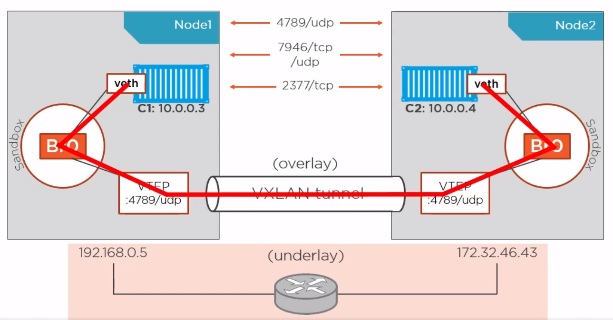

- Talán az egyik legmenőbb dolog az egész Docker hálózatkezelésben

- **Fontos:** A host gépeken a **4789/udp, 7946/tcp/udp, 2377/tcp** portoknak nyitva kell lenniük

**Konfiguráció: **

- `docker swarm init`
    - Először is, ahhoz, hogy ezt az egészet használni tudjuk engedélyeznünk kell az úgynevezett swarm módot

> Ezzel a paranccsal inicializálhatjuk az overlay hálózatunkat. Ezzel az aktuális host gépünk lesz a menedzsere ennek a hálózatnak. (Legyen ő az “A” hoszt)
>
> A visszakapott kódot kell majd beírni azokon gépeken, amiket szeretnénk csatolni ehhez a hálózathoz. Ha később újra szükségünk lenne erre a parancsra, egyszerűen adjuk ki az alábbi parancsot:
> `docker swarm join-token worker`

- `docker swarm join --token <TOKEN> <address:port>`
    - Ezzel a paranccsal csatlakozhatunk egy másik swarmhoz. Tehát ezt a parancsot a **MÁSIK** gépen kell kiadni. Legyen ő a “B” hoszt
    - `docker node ls`
        - Ezután ha “A” hoszton kiadjuk ezt a parancsot, láthatjuk hogy megjelent egy újabb elem a listában

        - “B” hoszton viszont nem fogunk visszakapni semmit. Ez azért van, mert ő egy úgynevezett “worker” node, nekik nincs rálátásuk erre, csak a “manager” node-nak.

- `docker network ls`
    - Megjelent 2 új hálózatunk

    - **docker\_gwbridge** - Az ábrán ő volt a **Br0.**

    - **ingress** - Ő a VXLAN tunnel

    - Lényegében ők ketten azok, akiken majd keresztül megy a kommunikáció

- Ezután létre kell hoznunk egy saját overlay hálózatot

    - `docker network create -d overlay --attachable pm-demo`

    - Az **--attachable** kapcsoló nélkül nem tudunk konténert, csak servicet belerakni ebbe a hálózatba

    - Fontos még megjegyezni, hogy bár a Docker Engine-ek közti kommunikáció ebben a formában titkosított, a konténerekben lévő alkalmazások kommunikációja nem lesz titkosítva.
      Amennyiben ezt szeretnénk bekapcsolni adjuk hozzá a **--opt encrypted** flaget. Az ok, amiért ez nem alapértelmezett az az, hogy esetekben komoly teljesítménybeli romlást
      eredményezhet

- Majd ezekbe a hálózatokba rakva, indítsuk el konténereket

    - “A” hoszt gépen:

        - `docker run -d --name c1 --network pm-demo alpine sleep 1d`

    - “B” hoszt gépen:

        - `docker run -d --name c2 --network pm-demo alpine sleep 1d`

### MACVLAN / IPVLAN

[*MacVLAN vs IPvlan: Understand the difference - IP With Ease*](https://ipwithease.com/macvlan-vs-ipvlan-understand-the-difference/)

Kiiktathatjuk a "middle-man"-t. Ezeknek a lehetőségével kaphatunk saját IP-t a halózatban. Így a host kihagyásával elérhetjük a konténerünket a hálózatban

- **MACVLAN** - Saját MAC címe lesz minden konténernek (Windows konténerrel nem működik)
    
    - Felhőszolgáltatóknál nem használható (Azure, AWS) Ez -többek közt- azért van, mert nem engedi a környezet a további MAC címek kiosztását.
    
    - Windowson egyáltalán nem működik
    
    - Fontos:
    
        - Nem a DHCP-től kapjuk az IP címet, hanem a Docker osztja nekünk
        - A hálózati interészünknek támogatnia kell és be kell legyen kapcsolva rajta a *“Promiscous mode” *Válogatás nélküli üzemmódnak*
            - [Promiscuous mode - Wikipedia](https://en.wikipedia.org/wiki/Promiscuous_mode)
    
    - Kimondottan körülményes működésre bírni, ezért ebből nem lesz demó
      > :(
    
    - Windowson a legközelebbi megfelelője az **l2brige** hálózattípus, de vannak fontos különbségek
    
      | Linux - macvlan | Windows - l2bridge |
      | ------------------------- | --------------------------|
      | Saját IP cím a hálózatban | Saját IP cím a hálózatban |
      | Saját MAC cím | Minden konténernek ugyanaz a MAC címe |
    
- **IPVLAN** - Nincs saját MAC cím, emiatt könnyen előfordulhat IP ütközés a hálózatban

    - Megvalósítható felhőben, egyes szolgáltatásokkal

    - Fontos, hogy a host gép nem tudja pingelni a benne lévő konténert! Ez okozhat némi fejfájást, amikor próbálkozunk vele :)

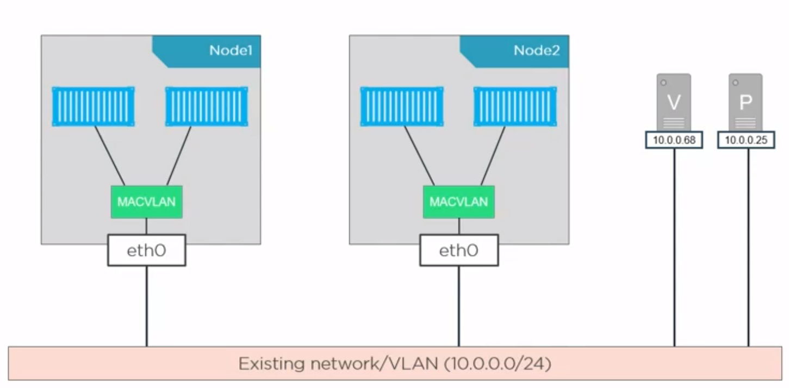

**Majd ez kintről már kb így fog kinézni**

**↓ **

**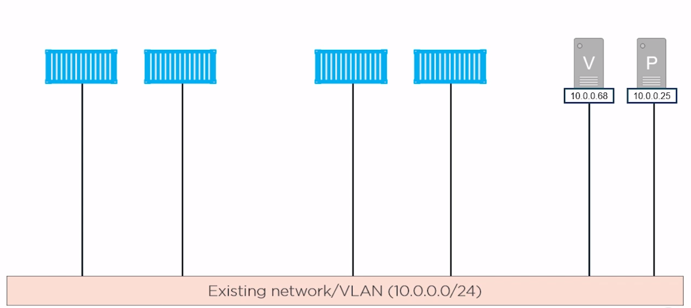**

1. Hozzuk létre a szükséges hálózatot az “A” gépen

   `docker docker network create -d ipvlan --subnet=192.168.0.0/24 --gateway=192.168.0.1 --ip-range=192.168.0.0/28 -o ipvlan_mode=l2 -o parent=eth0 pm-ipvlan`

   | **docker docker network create ** | Létrehozzuk a hálózatot       |
   | --------------------------------- | ----------------------------- |
   | -d ipvlan                         | megadjuk a drivert            |
   | --subnet=192.168.0.0/24           | megadjuk milyen alhálózatba kerüljön |
   | --gateway=192.168.0.1             | ez a default gatewayünk       |
   | --ip-range=192.168.0.0/28         | ebből az ip tartományból fog nekünk osztani |
   | -o ipvlan_mode=l2                 | ipvlan-mód, l2 a default      |
   | -o parent=eth0                    | a “szülő” hálózati interfészünk neve        |
   | pm-ipvlan                         | a hálózat neve                |

1. Hozzunk létre egy konténert az “A” gépen, és adjuk hozzá ezt a hálózatot

   `docker run -d --name c1 --network pm-ipvlan -p 8080:8080 --ip 192.168.0.100 magyarattila90/my-java-app:0.0.1`

   | **docker run **                  |                                |
   | -------------------------------- | -------------------------------|
   | -d                               | detached mode                  |
   | --name c1                        | konténer név                   |
   | --network pm-ipvlan              | a létrehozott hálózat csatolása|
   | -p 8080:8080                     | port kinyitása                 |
   | --ip 192.168.0.100               | ip explicit megadása           |
   | magyarattila90/my-java-app:0.0.1 | használni kívánt image         |

1. Majd “B” gépen: (ami fontos, hogy ugyanebben a hálózatban legyen, mint az “A” gép)

- **Fontos, mégegyszer:** Ugyanarról a gépről, amin létrehoztuk a konténert, nem fog működni!
- pingeljük meg a másik gép IP címét

> **ping 192.168.0.100**

- Nyissuk meg böngészőben az alkalmazást (vagy hívjunk be rá pl.: curl-lel)

> **192.168.0.100:8080**

## Gyakorló feladatok

1. Az előző, "Több konténeres" feladatot egészítsd ki
    - Mindegyik konténer legyen ugyanabban a hálózatban
    - Explicit határozzuk meg az IP címüket
    - Próbáld meg meg-pingelni egymást a konténerek belsejéből
        - Telepítsd a ping alkalmazást, ha nem elérhető!
2. (Opcionális) Reprodukáld az overlay networkot AWS-en, a tananyag alapján ( ha van rá mód )
3. (Opcionális) Reprodukáld az IPVLAN demót az otthoni hálózatunkban ( ha van rá mód )

Docker Secrets
==============

**docker secrets**

Csak Swarm módban, servicekkel működik

Stacks and Services
===================

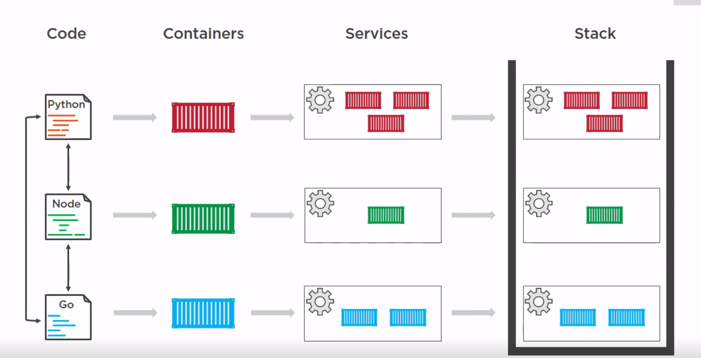

1 Dockerfile -> 1 Image -> Több konténer

Több konténer együtt -> 1 Service

Több service együtt -> 1 Stack

**Nagyon zanzásítva:**

A docker-compose fájlunkban lévő service-eket kiegészítjük egy ‘deploy:’ bekezdéssel (és a hozzá tartozó konfigurációkkal, persze) Majd a **docker stack** paranccsal ezt
“megetetjük” aki felhúzza és kezeli ezt az egész infrastruktúrát.

- Ezt már nem docker-compose-nak, inkább stackfile-nak szokták hívni

- **docker stack deploy -c stackfile.yml stack-name**

- Csak swarm módban működik

- Értelmet elsősorban akkor nyer *-főleg ha replikákat is csinálunk az egyes szolgáltatásokból-* ha több gépünk is van a hálózatban (overlay networkben), ezzel kihasználva a többlet erőforrásokat
  
- Csak Docker Compose 3.4-es verziótól felfelé érhetőek el ezek a feature-ök (*deploy*)

- Lehetőségünk nyílik (egyéb eszközök segítségével pl. a Kubernetes) a “vasat” is ehhez skálázni, automatikusan, dinamikusan, és ezeket behúzni swarm mód alá.
