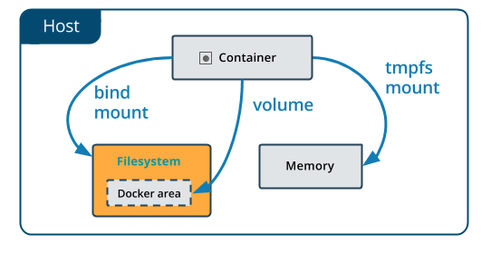

## Dockerignore

Mikor kiadjuk a `docker build .` parancsot, a parancs végén lévő ponttal határozzuk meg a *build contextet*. Ezt a környezetet fogja használni a docker buildelés közben. Ez azért
lehet fontos, hiszen ha például kiadunk egy `COPY . ./dir-in-container` parancsot, akkor a Docker a kontextben lévő összes fájlt át fogja másolni.

**De mi van akkor, ha szeretnénk bizonyos fájlokat kihagyni?**

Bizonyos esetekben nincs rá lehetőség, hogy a context könyvtárából eltávolítsunk olyan fájlokat, amiket nem szeretnénk bemásolni a konténerbe, ilyenkor lehetőségünk van létrehozni
egy úgynevezett `.dockerignore` fájlt. Ezt a fájlt a `Dockerfile`-unk mellé kell létrehozni majd ez automatikusan betöltésre kerül az image buildje során.

Nincs is más dolgunk, mint hogy felvegyünk az ignorálni kívánt fájlokat, és a Docker ezeket automatikusan ki fogja hagyni.

Példafájl

```.dockerignore
# A context rootjában lévő some-folder-re vonatkozik
./some-folder
some-folder


# Bármely mappán belüli some-folder-re vonatkozik
**/some-folder

# A some-folder-en belül mindenre vonatkozik
some-folder/**

# A some-folder-en belül minden .json kiterjesztésű fájlra vonatkozik
some-folder/*.json
```

Amiket általában célszerű itt megemlíteni ( a teljesség igénye nélkül)

- .git mappa
- build logok
- teszt szkriptek/eredmények
- átmeneti fájlok
- cache fájlok
- jelszavak, bizalmas adatok
- egyéb, helyi fejlesztési fájlok, pl.: docker-compose.yml
- *node_modules, .idea, build, target*... mappák

Commit
------

Amennyiben futó konténerben szeretnénk babrálni, majd annak az állapotát megőrizni, hogy újra indítható legyen belőle egy másik konténer, lehetőségünk van az aktuális állapotot
be-commitolni.

- `docker commit <container-name> <image-name:tag>`

- Fontos, hogy a kötetekben tárolt adatok nem lesznek benne a készült imageben! Bár egy apró workadounddal megoldható


## Gyakorló feladatok

1. Teszteld a .dockerignore-t működés közben. Egészítsd ki az előző feladatot!

    1. Hozz létre egy `hello.txt` fájlt a Dockerfile mellé
    2. Módosítsd úgy, hogy a build során másolja be a `hello.txt` fájlt a `/unignored-stuff` mappába.
    3. Legyen olyan file-od is (akár több is) a mappában, amit nem akarsz a konténerbe bemásolni!
    4. Adj hozzá minden szükségeset a `.dockerignore`-hoz, hogy a txt-n kívül, semmi mást ne másoljon át build közben!

Stateful, Stateless container/app - Kötetek
===========================================

Megfelelően használva a konténerek teljesen izoláltak, és állapotmentesek. Ez azt jelenti, hogy ha bármi módosítást csinálunk ezek belsejében, azok csak a lokális konténerben
lesznek jelen, de ha új konténert csinálunk ugyanabból az image-ből, azok az adatok el fognak tűnni.

Fontos, hogy futási időben ezek megmaradnak, és csak másik konténer indítása esetén fognak elveszni!

Mikor nem számít ez?

- A konténerek belsejében alapjában véve helytelen "matatni", de tesztelésre, fejlesztésre nekünk ez jó lehet

Mikor lehet rá szükség, hogy megőrizze az állapotát?

- Adatbázis szervernél, ahol hosszú távon szeretnénk megőrizni az adatainkat, abban az esetben is, ha esetleg több fizikai helyen fut az a konténer

Ahhoz, hogy meg tudjunk bármi adatot **hosszú távon** őrizni, egy írható, perzisztens részt kell létrehoznunk, és beállítanunk a konténerhez. Úgynevezett köteteket (*volume*) kell
létrehoznunk.



Erre három lehetőségünk van:
 - **bind mount**: egy a gazdagépen lévő könyvtárat (vagy fájlt) felcsatolunk a konténer fájlrendszerének egy elérési útjára, ennek eredményeként a konténer az adott elérési úton a megadott fogja használni a saját írható rétege helyett.
    - elérhető a Docker engine-től függetlenül
    - ha nem létezik a megadott elérési út, akkor könyvtárként létrehozza
    - nem tölthető fel a csatolás előtt a konténerben található adatokkal
    - a bekötni kívánt könyvtár abszolút elérési útját adjuk meg
    - `docker run -d --name <name_of_container> -v mysqldata:/var/lib/mysql -p 80:8080 mysql:latest`

        > **-d** detach, run in background
        >
        > **--name** név megadása
        >
        > **-v mysqldata:/var/lib/mysql** named-volume mountolása
        >
        > **-p** port-mapping

 - **volume**: a Docker által kezelt kötet jön létre, amit csatolhatunk a konténerben egy könyvtárhoz (filehoz).
    - nem nyúlhatunk bele "kívülről", csak a Docker kezelheti.
    - lehet anonym és nevesített
    - a Docker támogatja a backupolását és migrálását
    - `docker volume create <volume-name>`
      - létrehoz egy kötetet a megadott névvel

    - `docker volume ls`
      - kilistázza a jelenlegi köteteket

    - `docker run -v <volume-name>:/path/to/attach/inside/container `

 - **tmpfs**
   - ideiglenes kötetet hoz létre
   - nem perzisztens
   - nagyon gyors, csak a gazdagép memóriájában tárolódik

  Mindhárom esetben kétféle kapcsolót használhatunk:
   - **-v** (avagy --volume) : lásd feljebb
   - **--mount** : terjengősebb, kulcs-érték párok formájában adjuk meg  


## Gyakorló feladatok

1. MySql konténer
    - Keress egy hivatalos base-image-t hozzá
    - A konténer létrehozásánál legyen megadva az alábbi konfigurációk ( Nézd át az image dokumentációját! )
        - Hozz létre egy egyszerű volume-ot a Docker segítségével, majd ezt kösd be a MySQL-azon mappájába, ahol az adatbázis infoormációkat tárolja
2. PostgreSql konténer
    - Keress egy hivatalos base-image-t hozzá
    - A konténer létrehozásánál legyen megadva az alábbi konfigurációk ( Nézzük át az image dokumentációját! )
        - Kösd be egy tetszőleges lokális könyvtárba az adatbázis tartalmát
3. Kötetek megosztása konténerek között
    1. Hozz létre 3 különböző tetszőleges konténert.
    2. Mindegyikbe kösd be, a `/shared-stuff` mappába egy tetszőleges lokális könyvtárat ( **Mindegyikhez ugyanazt!** )
    3. Hozz létre ebbe a könyvtárba egy tetszőleges fájlt
    4. Ellenőrizd, hogy a fájlok láthatóak-e a konténer belsejéből
    5. Hozz létre a csatolt útvonalon egy fájlt, de a konténer belsejéből!
    6. Az előzőt kiegészítve, a csatolt könyvtár legyen csak olvasható a konténerek számára!
    7. Próbálj meg így létrehozni, vagy törölni egy fájlt ebben a könyvtárban a konténer shelljéből!

Multi-stage builds
------------------

[Dockerfile reference | Use multi-stage builds](https://docs.docker.com/develop/develop-images/multistage-build/)

```dockerfile
# STAGE 1
FROM node:lts-alpine3.15 AS frontend
WORKDIR /usr/src/frontend
COPY ./frontend/package.json .
RUN npm install
copy ./frontend/ .
RUN npm run build

# STAGE 2
FROM maven:latest AS backend
WORKDIR /usr/src/
COPY ./my-server/pom.xml .
RUN mvn -f pom.xml dependency:resolve
COPY ./my-server/ .
RUN mvn package -DskipTests

# STAGE 3
FROM openjdk:11.0.13-jre-slim-buster
WORKDIR /static
COPY --from=frontend /usr/src/frontend/build/ .
RUN apt update && apt install nginx -y
COPY ./frontend-conf /etc/nginx/sites-available/
RUN ln -s /etc/nginx/sites-available/frontend-conf/etc/nginx/sites-enabled/
WORKDIR /app
COPY --from=backend /usr/src/target/my-server-0.0.1-SNAPSHOT.jar .
ENTRYPOINT \["java","-jar","/app/my-server-0.0.1-SNAPSHOT.jar"\]
```

Az imageinket célszerű mindig a lehető legkisebb méretűn tartani. Erre lehet egy szuper megoldás az úgynevezett multi-stage build koncepciója.

Az ábrán szereplő példában például:

- Első szakaszban

    - figyeljük meg, hogy az első ***FROM*** parancsban adunk egy aliast az imageünknek

    - Átmásoljuk a *package.json* fájlt, ebben találhatóak az alkalmazásunk függőségei

    - Az `npm install` paranccsal letöltjük ezeket a függőségeket. Ennek az a jelentősége, hogy ha nem változik a fájl, akkor el lesz cachelve ennek az eredménye, így nem lesz
      szükség minden alkalommal letölteni ezeket a fájlokat

- Átmásoljuk a React alkalmazásunk fájljait

- Buildlejük az alkalmazást
- Második szakaszban:

    - Átmásoljuk a *pom.xml* fájlunkat, majd ez alapján feloldjuk az alkalmazásunk függőségeit.
- Buildeljük és becsomagoljuk az alkalmazást a *Maven* segítségével
- Harmadik, utolsó szakasz:

    - Itt a COPY parancs a legfontosabb. A ***--from*** kapcsoló segítségével tudjuk megadni, hogy melyik stage ***artifact-ját*** szeretnénk átmásolni

    - **COPY --from=source-stage \<source-path> \<destination-path>**

## See also

[*Start containers automatically*](https://docs.docker.com/config/containers/start-containers-automatically/)