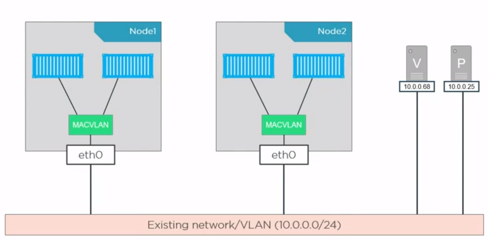
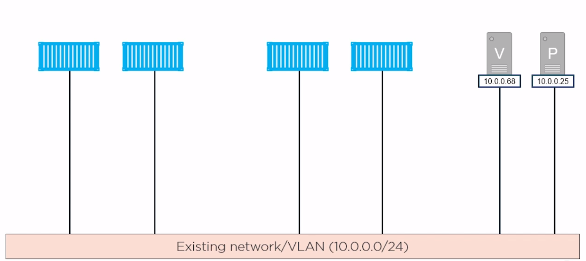
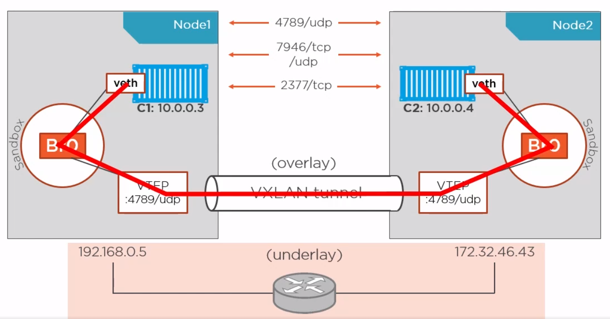

Networking
==========

Alapvetően az összes konténerünk egy belső bridge alá kerül be. Ami biztosítani fog saját IP címet mindegyiknek.

- `docker network ls`
    - létező docker hálózatok listázása

- `docker network inspect <network-name>`
    - részletes információk a hálózatról
    - `docker network inspect bridge`
        - láthatjuk, ha fut jelenleg bármilyen konténer, az alapértelmezetten ebbe a hálózatba fog bekerülni, ami automatikusan kioszt neki egy IP címet

Hálózat típusok
---------------

### bridge - single-host networking

Egyszerű ***bridge*** segítségével lehetőségünk van kommunikációra a konténterek között.

- Linuxon és Windowson egyaránt működik.

- Lényegében egy virtual switch-et hoz létre

- Az alapértelmezett hálózat is ilyen típusú amibe kerülnek a konténerjeink.

- A single-host annyit jelent, hogy nincs rá mód hogy 2 ilyen hálózat kommunikálni tudjon egymással, erre vannak speciálisabb típusok

- Érdekesség, hogy minden ilyen hálózat, alapból tartalmaz egy DNS-resolvert ami a konténerünk nevét fel tudja oldani annak IP címére. Fontos, hogy ehhez használjuk a **--name**
  kapcsolót a konténerekhez

> `docker network create -d bridge my-network`
>
> `docker run -d --name my-app1 --network my-network magyarattila90/my-java-app:0.1`
>
>`docker run -d --name my-app2 --network my-network magyarattila90/my-java-app:0.1`
>
> `docker exec -it my-app1 bash`
>
> `:/# ping my-app2`

### MACVLAN / IPVLAN

[*MacVLAN vs IPvlan: Understand the difference - IP With Ease*](https://ipwithease.com/macvlan-vs-ipvlan-understand-the-difference/)

Kiiktathatjuk a "middle-man"-t. Ezeknek a lehetőségével kaphatunk saját IP-t a halózatban. Így a host kihagyásával elérhetjük a konténerünket a hálózatban

- **MACVLAN** - Saját MAC címe lesz minden konténernek (Windows konténerrel nem működik)
    - Felhőszolgáltatóknál nem használható (Azure, AWS) Ez -többek közt- azért van, mert nem engedi a környezet a további MAC címek kiosztását.

    - Windowson egyáltalán nem működik

    - Fontos:

        - Nem a DHCP-től kapjuk az IP címet, hanem a Docker osztja nekünk
        - A hálózati interészünknek támogatnia kell és be kell legyen kapcsolva rajta a *“Promiscous mode” *Válogatás nélküli üzemmódnak*
            - [Promiscuous mode - Wikipedia](https://en.wikipedia.org/wiki/Promiscuous_mode)

    - Kimondottan körülményes működésre bírni, ezért ebből nem lesz demó
      > :(

    - Windowson a legközelebbi megfelelője az **l2brige** hálózattípus, de vannak fontos különbségek

      | Linux - macvlan           | Windows - l2bridge                    |
      | ------------------------- | ------------------------------------- |
      | Saját IP cím a hálózatban | Saját IP cím a hálózatban             |
      | Saját MAC cím             | Minden konténernek ugyanaz a MAC címe |

- **IPVLAN** - Nincs saját MAC cím, emiatt könnyen előfordulhat IP ütközés a hálózatban

    - Megvalósítható felhőben, egyes szolgáltatásokkal

    - Fontos, hogy a host gép nem tudja pingelni a benne lévő konténert! Ez okozhat némi fejfájást, amikor próbálkozunk vele :)

**Majd ez kintről már kb így fog kinézni**

**↓ **

****

1. Hozzuk létre a szükséges hálózatot az “A” gépen

   `docker docker network create -d ipvlan --subnet=192.168.0.0/24 --gateway=192.168.0.1 --ip-range=192.168.0.0/28 -o ipvlan_mode=l2 -o parent=eth0 pm-ipvlan`

   | **docker docker network create ** | Létrehozzuk a hálózatot                     |
   | --------------------------------- | ------------------------------------------- |
   | -d ipvlan                         | megadjuk a drivert                          |
   | --subnet=192.168.0.0/24           | megadjuk milyen alhálózatba kerüljön        |
   | --gateway=192.168.0.1             | ez a default gatewayünk                     |
   | --ip-range=192.168.0.0/28         | ebből az ip tartományból fog nekünk osztani |
   | -o ipvlan_mode=l2                 | ipvlan-mód, l2 a default                    |
   | -o parent=eth0                    | a “szülő” hálózati interfészünk neve        |
   | pm-ipvlan                         | a hálózat neve                              |

1. Hozzunk létre egy konténert az “A” gépen, és adjuk hozzá ezt a hálózatot

   `docker run -d --name c1 --network pm-ipvlan -p 8080:8080 --ip 192.168.0.100 magyarattila90/my-java-app:0.0.1`

   | **docker run **                  |                                 |
   | -------------------------------- | ------------------------------- |
   | -d                               | detached mode                   |
   | --name c1                        | konténer név                    |
   | --network pm-ipvlan              | a létrehozott hálózat csatolása |
   | -p 8080:8080                     | port kinyitása                  |
   | --ip 192.168.0.100               | ip explicit megadása            |
   | magyarattila90/my-java-app:0.0.1 | használni kívánt image          |

1. Majd “B” gépen: (ami fontos, hogy ugyanebben a hálózatban legyen, mint az “A” gép)

- **Fontos, mégegyszer:** Ugyanarról a gépről, amin létrehoztuk a konténert, nem fog működni!
- pingeljük meg a másik gép IP címét

> **ping 192.168.0.100**

- Nyissuk meg böngészőben az alkalmazást (vagy hívjunk be rá pl.: curl-lel)

> **192.168.0.100:8080**

### overlay - multi-host networking

Swarm módban lehetőségünk van egy virtuális hálózat alá rendezni a konténerjeinket, még akkor is, ha ők különböző gépeken léteznek.

- Talán az egyik legmenőbb dolog az egész Docker hálózatkezelésben

- **Fontos:** A host gépeken a **4789/udp, 7946/tcp/udp, 2377/tcp** portoknak nyitva kell lenniük

**Konfiguráció: **

- `docker swarm init`
    - Először is, ahhoz, hogy ezt az egészet használni tudjuk engedélyeznünk kell az úgynevezett swarm módot

> Ezzel a paranccsal inicializálhatjuk az overlay hálózatunkat. Ezzel az aktuális host gépünk lesz a menedzsere ennek a hálózatnak. (Legyen ő az “A” hoszt)
>
> A visszakapott kódot kell majd beírni azokon gépeken, amiket szeretnénk csatolni ehhez a hálózathoz. Ha később újra szükségünk lenne erre a parancsra, egyszerűen adjuk ki az alábbi parancsot:
> `docker swarm join-token worker`

- `docker swarm join --token <TOKEN> <address:port>`
    - Ezzel a paranccsal csatlakozhatunk egy másik swarmhoz. Tehát ezt a parancsot a **MÁSIK** gépen kell kiadni. Legyen ő a “B” hoszt
    - `docker node ls`
        - Ezután ha “A” hoszton kiadjuk ezt a parancsot, láthatjuk hogy megjelent egy újabb elem a listában

        - “B” hoszton viszont nem fogunk visszakapni semmit. Ez azért van, mert ő egy úgynevezett “worker” node, nekik nincs rálátásuk erre, csak a “manager” node-nak.

- `docker network ls`
    - Megjelent 2 új hálózatunk

    - **docker\_gwbridge** - Az ábrán ő volt a **Br0.**

    - **ingress** - Ő a VXLAN tunnel

    - Lényegében ők ketten azok, akiken majd keresztül megy a kommunikáció

- Ezután létre kell hoznunk egy saját overlay hálózatot

    - `docker network create -d overlay --attachable pm-demo`

    - Az **--attachable** kapcsoló nélkül nem tudunk konténert, csak servicet belerakni ebbe a hálózatba

    - Fontos még megjegyezni, hogy bár a Docker Engine-ek közti kommunikáció ebben a formában titkosított, a konténerekben lévő alkalmazások kommunikációja nem lesz titkosítva.
      Amennyiben ezt szeretnénk bekapcsolni adjuk hozzá a **--opt encrypted** flaget. Az ok, amiért ez nem alapértelmezett az az, hogy esetekben komoly teljesítménybeli romlást
      eredményezhet

- Majd ezekbe a hálózatokba rakva, indítsuk el konténereket

    - “A” hoszt gépen:

        - `docker run -d --name c1 --network pm-demo alpine sleep 1d`

    - “B” hoszt gépen:

        - `docker run -d --name c2 --network pm-demo alpine sleep 1d`

## Gyakorló feladatok

1. Az előző, "Több konténeres" feladatot egészítsd ki
    - Mindegyik konténer legyen ugyanabban a hálózatban
    - Explicit határozzuk meg az IP címüket
    - Próbáld meg meg-pingelni egymást a konténerek belsejéből
        - Telepítsd a ping alkalmazást, ha nem elérhető!
2. (Opcionális) Reprodukáld az overlay networkot AWS-en, a tananyag alapján ( ha van rá mód )
3. (Opcionális) Reprodukáld az IPVLAN demót az otthoni hálózatunkban ( ha van rá mód )

Docker Services
===============

[*CLI reference*](https://docs.docker.com/engine/reference/commandline/service/)

A Docker-compose esetében már szó esett róla, hogy itt már nem konténerekről, hanem service-ekről beszélünk. Ez egy lépés a felhőszolgáltatások, clusterek, és a Kubernetes felé. Ez
a “kis” változás azonban óriási potenciált hordoz magában.

Lehetőségünk van többek közt:

- load-balancing-ra az egyes service-ek között

- horizontális skálázásra (konténer, és nem host szinten)

- health-checkre

- teljes infrastruktúra kiépítésére

Hozzuk létre a saját serviceünket!

1. Először is, engedélyeznünk kell a swarm módot a gépünkön:

    - `docker swarm init`

2. Hozzunk létre CLI-ből egy servicet. Ennek a módja, szinten teljesen megegyezik a konténerek indításával

    - `docker service create -d -p 8080:8080 --name my-java-service magyarattila90/my-java-app:0.1`

      | docker service create          | service létrehozása            |
      | ------------------------------ | ------------------------------ |
      | -d                             | a háttérben                    |
      | -p 8080:8080                   | nyissuk ki a 8080-as portot    |
      | --name my-java-service         | nevezzük el                    |
      | magyarattila90/my-java-app:0.1 | és használjuk az alábbi imaget |

3. Listázzuk ki az aktuális service-eket, és vizsgáljuk is meg a létrehozott service-t

    - `docker service ls`

    - `docker inspect my-java-service`

4. Következő lépésben skálázzuk ezt a szolgáltatást!

    - `docker service scale my-java-service=3`

    - `docker service ls`

    - `docker ps`

5. Nyissuk meg a böngészőből a service címét

> **x.x.x.x:8080**
>
> Ami ebben az igazán menő, hogy a service automatikusan kap egy virtuális IP címet, és ő irányítja tovább a forgalmat az egyes REPLICA-k felé! Jelen esetbe ezt nehéz demózni, de amennyiben nő a terhelés egyes konténereken, úgy másfelé fogja irányítani a kéréseket.
>
> Ez az internal-load balancing.
>
>Van lehetőség external load-balancing-ra is, amikor pl egy **nginx** proxy-zza tovább a kéréseket, viszont ez jóval több konfigurációval jár.

See also
--------

[*How to Implement Docker Health Checks | by Nassos Michas | Better Programming*](https://betterprogramming.pub/docker-healthchecks-eb744bfe3f3b)

Stacks and Services
===================

1 Dockerfile -> 1 Image -> Több konténer

Több konténer együtt -> 1 Service

Több service együtt -> 1 Stack

**Nagyon zanzásítva:**

A docker-compose fájlunkban lévő service-eket kiegészítjük egy ‘deploy:’ bekezdéssel (és a hozzá tartozó konfigurációkkal, persze) Majd a **docker stack** paranccsal ezt
“megetetjük” aki felhúzza és kezeli ezt az egész infrastruktúrát.

- Ezt már nem docker-compose-nak, inkább stackfile-nak szokták hívni

- **docker stack deploy -c stackfile.yml stack-name**

- Csak swarm módban működik

- Értelmet elsősorban akkor nyer *-főleg ha replikákat is csinálunk az egyes szolgáltatásokból-* ha több gépünk is van a hálózatban (overlay networkben), ezzel kihasználva a
  többlet erőforrásokat

- Csak Docker Compose 3.4-es verziótól felfelé érhetőek el ezek a feature-ök (*deploy*)

- Lehetőségünk nyílik (egyéb eszközök segítségével pl. a Kubernetes) a “vasat” is ehhez skálázni, automatikusan, dinamikusan, és ezeket behúzni swarm mód alá.