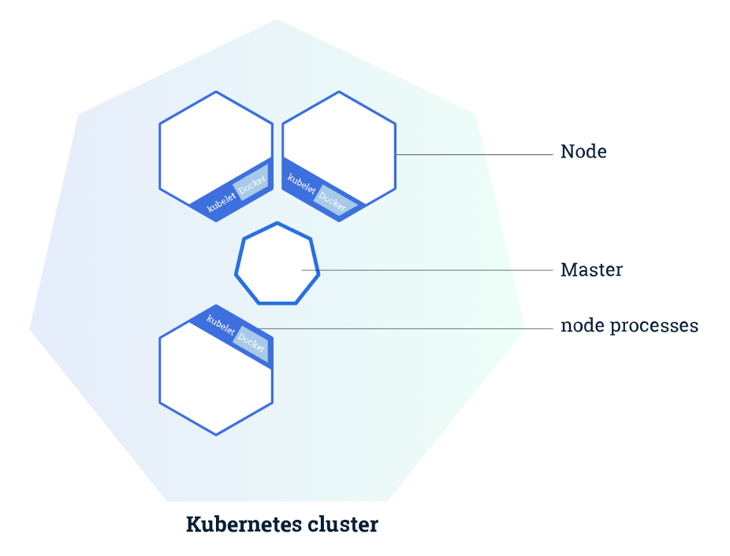
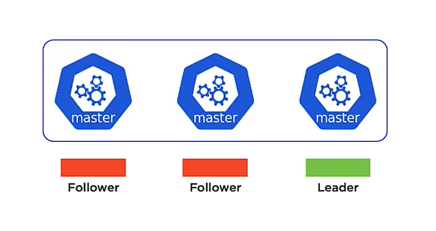
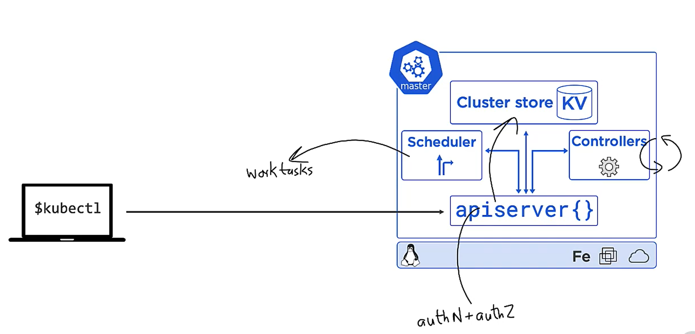
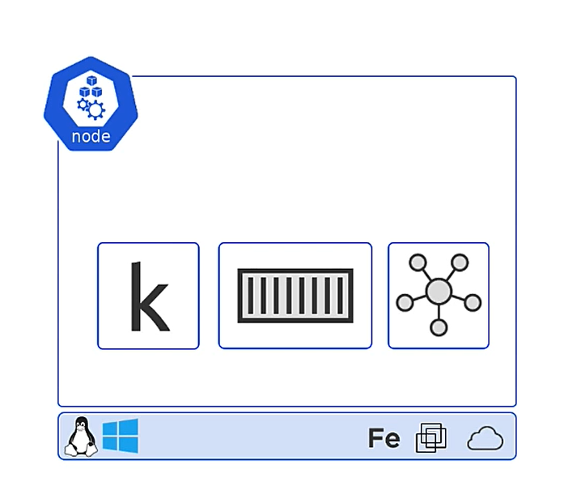

**Topics**

- K8 History
- Basic concepts
  - Worker és Master node-ok. Azokon futó service-ek
  - Podok, Deploymentek
  - Declarative Model and Desired State

# Kubernetes - K8S, Orchestration

# Bevezetés

> Kubernetes - görög eredetű szó, jelentése kapitány ( captain, helmsman )

Már jóval a Docker ideje előtt, a Google teljes platformja (kereső, Gmail) konténerekben futott. Mivel óriási méretekről
beszéltünk, ezért a konténerek manuális kezelése szóba sem jöhetett. 

***Borg*** - Ezen a néven futott a legelső orkesztrációs projekt. Érdekessége az, hogy ez megelőzte a Linuxos kernel featuret, a cgroupokat, amire a mai konténerizációs technológiák erősen építenek. 

Fun fact: A nevét egy Star Trek részből kapta.

Nem sokkal ezután kezdett egyre nagyobb népszerűségre szert tenni a Docker is. Aminek sikerült eléggé megreformálnia azt, ahogy a konténerekre tekintünk.

Ezeket a tanulságokat, és a Borg fejlesztése során szerzett tapasztalatokat felhasználva jött létre a következő projekt, az **Omega**.

Majd mindkettő hibáiból és sikereiből tanulva, létrejött -az ekkor már open-source- ***Kubernetes***! Bár a Google szárnyai alatt jött létre, azóta átkerült a [**Cloud Native Computing Foundation**](https://landscape.cncf.io/)-hoz. 

A Docker világából ismert "konténeres", teherhajós, hajós analógiák nagy hatással voltak a platform nevére. Ezért lett ő a "kormányos".  

Egy Open Source platfromról van szó, rengeteg sok contributorral, akik hozzájárulnak a platform fejlődéséhez.

Remek analógia ( hamár úgyis orkesztrációról beszélünk ) egy színházi zenekar, és a karmester esete. Ebben az esetben
gondolhatunk a zenekarra, mint a konténerjeinkre, ők végzik a munkát, viszont maguktól nem tudnák, hogy pontosan mikor
és mit kell csinálniuk. A karmester pedig a K8S, ő koordinálja, irányítja a zenészeket, hogy mindig csak annyian és úgy
játszanak, ahogy az ideális.

A konténerek és a micro-service-ek elterjedése egy rakás új üzemeltetési problémát hozott magával.	

Ahogy azt már tudjuk, a Docker felelős a konténereink életciklusáért: indítás, leállítás, törlés. Ő kezeli a low-level
dolgokat. Ezzel szemben a K8S nem foglalkozik "részletekkel". Ő az, aki a skálázásért, a hostok "egészségéért",
frissítéséért stb. felel.

# Alapok, alap koncepciók

## Cluster

A teljes infrastruktúránk összességét nevezzük a klaszternak. Ez alá tartozik az összes node-unk, virtuális gépünk, konténerünk és minden egyéb.

## Node-ok

### Master Nodes

- Ez az Vezérlő központ a **Master Node**, aki koordinálja fogja az alá tartozó node-okat.

  > a.k.a. control plane, head node

- Ezeknek a nodeoknak az összességét (master + worker node) nevezzük a K8s clusternek.

Fontos, hogy ezekből mindig több van. Még fontosabb, hogy ezek bár egy hálózatban kell, hogy legyenek, különböző **
fizikai** helyen célszerű, hogy létezzenek. (single-point-of-failure) Ha lehal a master node, akkor képtelenek leszünk
módosításokat végezni a clusterunkben.

Ezeket általában páratlan számban hozzák létre, a bűvös szám általában a három. A páratlan azért fontos, hiszen ha
például 4 gépből áll, és "két felé szakad a hálózat" értsd 2-2 gép képtelen elérni egymást, akkor egy úgynevezett
dead-lock tud kialakulni, egyik gép sem éri el a "többséget", és egy kvázi belső szavazás útján, nem tudnak dűlőre
jutni, ki legyen a "főnök".

Ez a hierarchia valóban létezik a masterek között, közülük mindig egy gép lesz a `leader` a többi pedig a `follower`.

Egy ilyen master node, rengeteg k8s szolgáltatást tartalmaz:

#### Kube API Server

- Egy frontendként szolgál a vezérlőpulthoz
- Rest API-t használ
- Elsősorban JSON/YAML-el kommunikál
- Neki fogjuk elküldeni a cluster infókat, ő lesz aki a kérést authentikálja, ellenőrzi, majd delegálja a többi
  szolgáltatásnak az információkat.

#### Cluster Store

- Ő tárolja a cluster állapotát és konfigurációját
- A háttérben egy ***etcd*** alapú NoSQL adatbázist használ
- Az ő teljesítménye mérsékelten kritikus.

#### Kube-controller-manager

- Rengeteg kis vezérlő szolgáltatás van benne, mind valami más és másért felelős.
    - Node controller
    - Deployment controller
    - Endpoints controller
    - ...
- Ő lesz az, aki megfelelteti az aktuálissal infrastruktúra állapotot az elvárttal.

#### Kube-scheduler

- Figyel az API serverre és várja az újabb feladatokat, majd kiosztja a feladatokat a cluster node-jainak

### Worker Nodes

Worker Node-oknak nevezzük a hoszt- vagy virtuális gépeket, szervereket. Az egész működéséhez mindegyik ilyenen működnie
kell egy Docker Runtime-nak (Enginenek) **plusz** egy K8S Agentnek. Őket fogja összekötni egy K8S vezérlő központ.

#### Kubelet

- Ő lesz a K8s agent
  - Regisztrálni fogja a node-ot a clusterben
  - Folyamatosan figyeli az API Server, az esetleges új feladatokért ( pl hogy létrehozzon egy Podot )
  - Elindítja a Podot
  - Majd jelent a Masternek, hogy sikerült

- Fontos, hogy ő nem tudja hogy kell kezelni a konténereket, ezért szüksége lesz egy újabb építő
  elemre, egy Container Runtime-ra (jelen esetben: Docker Engine)

#### Container runtime

- Ez lehet akár Docker is, de a K8s a konténer platformok zömét támogatja.
- Ő lesz a low-level réteg, aki ténylegesen kezelni fogja a konténereket.

#### Kube-proxy

- Ő a hálózat menedzsmentért felelős
- Például a Pod-ok IP címe, alapvető load-balancing

## **Podok**

- Ez a legkisebb "szállítási egység" a K8s-ben (atomic)
- Ahhoz, hogy el tudjuk helyezni az alkalmazásunkat, konténerünket egy ilyen K8s clusterben, be kell csomagolni őt egy ilyen Podba
- Egy pod-ban akár több konténer is futhat.

## A leíró model és az elvárt állapot - Declarative Model and Desired State

A lényeg: Megfogalmazzuk mit szeretnénk megvalósítani egy *manifest* fájlban.
Leírásról beszélünk, hogyan szeretnénk hogy kinézzen a végeredmény, tehát nem a megvalósítás módját írjuk le. A
megvalósítás a K8s dolga lesz!

## See also

- Kubernetes Components - https://kubernetes.io/docs/concepts/overview/components/
- https://www.usenix.org/conference/srecon17europe/program/presentation/turner
- Google: Virtual Kubelet - Nodeless kubernetes
- Mi az a REST? - https://gist.github.com/alexserver/2fcc26f7e1ebcfc9f6d8
