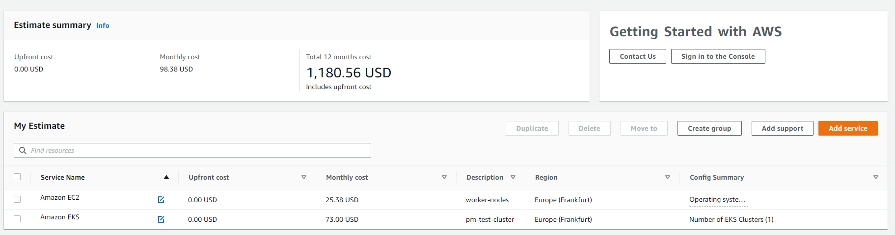

**Topics**

- EKS Intro
- Setup - Szükséges eszközök
- Cluster létrehozása imperatív és deklaratív módon
- Cluster skálázás
- Node-ok elérése SSH-n keresztül

# K8 in Cloud - AWS - Getting started with Amazon EKS

## Miért EKS?

Elastic Kubernetes Service - Az AWS ad és elvesz

## Mennyibe fog ez fájni nekünk?

Nézzünk meg különböző konfigurációkat: https://calculator.aws/#/addService/EKS



1 Cluster + 3 Worker node (on-demand - t2.micro, napi 50%-os kihasználtság mellett)

# Setup

Amire szükségünk lesz

- AWS CLI
- AWS Fiók + CLI Access key
- Kubectl
- Eksctl
- Helm

[Setup](./02-Setup.md)

# Cluster létrehozása

## Cluster létrehozása - Imperatív módon

**Eksctl** segítségével 

```bash
eksctl create cluster --name my-cluster --region region-code
```

```bash
eksctl create cluster --name pm-test-cluster --region eu-central-1
```

> Ez egy jó 10-20 percig fog tartani, nem kell megijedni!

Ha esetleg közben lelőttük volna a processzt, utólag ezzel tudjuk updatelni az AWS konfigunkat

```bash
aws eks update-kubeconfig --region eu-central-1 --name pm-test-cluster
```

Teszt

```bash
eksctl get clusters
kubectl get nodes
```

### Cluster törlése

```bash
eksctl delete cluster --region eu-central-1 --name pm-test-cluster
kubectl config get-clusters
kubectl config get-contexts
kubectl config get-users
kubectl config unset clusters.arn:aws:eks:eu-central-1:811644297090:cluster/pm-test-cluster
kubectl config unset contexts.arn:aws:eks:eu-central-1:811644297090:cluster/pm-test-cluster
kubectl config unset users.arn:aws:eks:eu-central-1:811644297090:cluster/pm-test-cluster
```

## Cluster létrehozása - Deklaratív módon

A klaszterünk konfigurációja írja le, milyen virtuális gépeket szeretnénk majd létrehozni, ezeket hogy szeretnénk elérni stb.
Fontos: Sajnos egyelőre korlátozottak a lehetőségek, ha ebben később valamit meg szeretnénk változatatni, sok esetben
újra kell húzni a teljes clustert

Először is, hozzunk létre egy SSH kulcsot, amivel majd be tudunk SSH-zni a szervereinkre

```bash
cd /tetszoleges/konyvtar/
ssh-keygen -t rsa # Fájl név legyen 'eksctl-nodes-key'
```

[Eksctl reference](https://eksctl.io/usage/schema/)

### Create cluster

`cluster.yaml`

```yaml
apiVersion: eksctl.io/v1alpha5
kind: ClusterConfig
metadata: 						# https://eksctl.io/usage/schema/#metadata
  name: pm-test-cluster
  region: eu-central-1
nodeGroups: 					# https://eksctl.io/usage/schema/#nodeGroups
  - name: ng-1
    instanceType: t4g.large
    minSize: 0
    maxSize: 3
    desiredCapacity: 2
    volumeType: gp2               # General Purpose SSD
    volumeSize: 30
    ssh:
      allow: true
      publicKeyPath: ~/.ssh/eksctl-nodes-key.pub    # we update with our preferred key
```

```bash
eksctl create cluster -f cluster.yaml

kubectl get nodes -o wide			# '-o' kapcsolóval különböző formátumú outputot kérhetünk, pl: wide | json | yaml 
ssh -i ~\.ssh\eksctl-nodes-key ec2-user@<node-ip>

eksctl delete cluster -f cluster.yaml
```

## **Dry run** 

Ez alapján kaphatunk valami sablont, amit fel tudunk használni

```
eksctl create cluster --name development --dry-run
```

## Cluster skálázása

```bash
eksctl get nodegroup --cluster pm-test-cluster

eksctl scale nodegroup --cluster pm-test-cluster --nodes=3, --name=ng-1
eksctl scale nodegroup --cluster pm-test-cluster --nodes-max=3 --nodes-min=1, --name=ng-1
eksctl scale nodegroup --cluster pm-test-cluster --nodes-max=3 --nodes=3, --name=ng-1
eksctl scale nodegroup --cluster pm-test-cluster --nodes-min=1 --nodes=1, --name=ng-1
```

## Hivatalos AWS tananyagok

- https://explore.skillbuilder.aws/learn/course/external/view/elearning/57/amazon-eks-primer

- https://explore.skillbuilder.aws/learn/course/external/view/elearning/11276/troubleshooting-amazon-elastic-kubernetes-service-amazon-eks 

## See also

- https://eksctl.io/usage/fargate-support/

- https://github.com/weaveworks/eksctl/tree/main/examples

- Max pod / instance [AWS-en](https://github.com/awslabs/amazon-eks-ami/blob/master/files/eni-max-pods.txt)

**Cikkek**

- https://cloudgeometry.io/blog/amazon-eks/
- https://www.digitalocean.com/community/tutorials/architecting-applications-for-kubernetes 
- https://www.digitalocean.com/community/tutorials/an-introduction-to-kubernetes (Kubernetes Objects and Workloads-ig elég)
- https://learnk8s.io/kubernetes-node-size

**Homokozók**

- https://killercoda.com/playgrounds/scenario/kubernetes

- https://minikube.sigs.k8s.io/docs/

**Hivatalos Kubernetes GitHub fiók, remek sablonokkal, segédanyagokkal**

- https://github.com/kubernetes

**Házi feladat** 

- Itt mindenképpen tanulságos megnézni, hogy mennyibe fáj egy ilyen infrastruktúra. Érdemes megnézni, különböző instance-typeokkal és savings planekkel stb: https://calculator.aws/#/addService/EKS
- Keresgélj doksikat a K8 architektúrájáról, a master és worker node-on lévő service-ekről
- Nézd meg a különböző AWS szolgáltatásokat, amik létrejöttek ( böngészőben ) 
  - CloudFormation 
  - EKS
  - AutoScaling Group
  - EC2 instances
- Töröld és hozd létre újra a clustert (**egyszerre max 1 cluster legyen!**), játsz a különféle konfigurációkkal 
