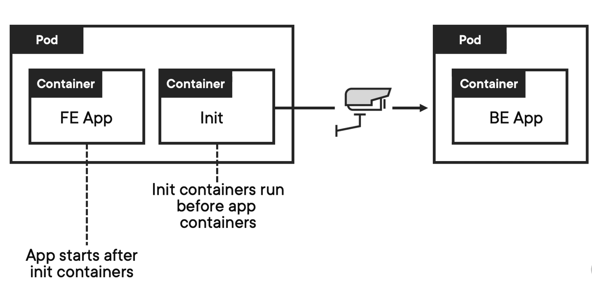

**Topics**

- Alkalmazás telepítése imperatív és deklaratív módon
- Namespaces
- Podok, Deploymentek, Servicek
- Multi container pods
  - Ambassador pattern
  - Adapter pattern
  - Sidecar pattern
  - Init containers

# Alkalmazás telepítése K8 cluster alá

##  Imperatív módon

### Adjuk ki az alábbi parancsokat

```bash
kubectl create deployment demo-app --image=nginxdemos/hello
kubectl expose deployment demo-app --type=LoadBalancer --port 80 --target-port 80
```

### Ellenőrzés

```
 kubectl get all -o wide
```

A parancs kiadásával látni fogjuk, hogy 4 féle resource jött létre:

- Pod
- Deployment
- Service
- ReplicaSet

Adjuk ki ismét a parancsot, mostanra már talán megjelent egy IP vagy FQDN a service External-IP oszlopában. Nyissuk ezt meg a böngészőben!

### Skálázás

Adjuk ki az alábbi parancsot, majd nézzük meg a böngészőben hogy mi történik ha frissítgetjük az oldalt.

```
kubectl scale deployment demo-app --replicas=3
```

### Cleanup

Töröljünk minden létrehozott erőforrást

```bash
kubectl get pods
kubectl delete pods <pod-name>
```

Nézzük meg mi történik, ha csak egy podot akarunk törölni!

```bash
kubectl delete deployment demo-app
kubectl delete svc demo-app
```

## Alkalmazás telepítése deklaratív módon

### Elérhető resource-ok

Először is fussuk át, milyen resource-okat is tudunk kezelni a clusterben.

Több lehetőségünk is van erre, hogy felderítsük, hogyan is tudunk kommunikálni a clusterünkkel, illetve milyen egyéb erőforrásokat tudunk kezelni.

### OpenAPI szabvány

Először is nyissunk egy proxy-t a cluster felé, a parancs segítségével átirányíthatjuk a `localhost:8080`-ra érkező összes forgalmat, az API szerver címére

```shell
kubectl proxy --port=8080
```

Majd nyissuk meg böngészőben az alábbi címet: `http://localhost:8080/openapi/v2`

Ez egy `.json` fájllal fog nekünk válaszolni, de ezt behúzhatjuk az alábbi oldara: https://editor-next.swagger.io/, ahol lehetőségünk van böngészni az API végpontokat ( note: ezeket mi nem fogjuk kézzel, közvetlenül meghívni, viszont ezeket hívja meg a `kubectl` )

### api-resources

Az alábbi parancs segítségével lekérdezhetjük az összes kezehlető erőforrást és néhány hasznos infromációt ami hozzájuk kapcsolódik

```bash
kubectl api-resources
```

---

### Egy alap alkalmazás felkonfigurálása deklaratív módon

#### Namespace - https://kubernetes.io/docs/reference/kubernetes-api/cluster-resources/namespace-v1/

https://kubernetes.io/docs/concepts/overview/working-with-objects/namespaces/

A Kubernetes Namespace-ek lehetővé teszik, hogy a clusterünket külön logikai csoportokra bontsuk. Egy nagyobb cégnél, különböző csapatok vagy projektek lennének ugyanazon a clusteren. Ha mindenki ugyanabba a cluszterbe telepítené alkalmazását, az idővel kaotikus lenne. Ezért létre kell hozni egy névteret a különböző csapatok, projektek vagy projektszakaszok számára. Például lehet egy névtér a fejlesztéshez (development), egy másik az éles környezethez (production) és egy másik a teszteléshez (testing).

Hozzunk létre dedikált névtereket a szolgáltatásainknak, hogy el tudjuk különíteni azokat

`namespace.yaml`

```yaml
apiVersion: v1
kind: Namespace
metadata:
  name: nginx-application
  labels:
    name: test
```

```bash
kubectl get namespaces
kubectl get ns
kubectl apply -f namespace.yaml
kubectl get ns
```

Ezután, ha egy requesthez az új névteret szeretnénk használni, csak adjuk hozzá az alábbi kapcsolót: 
`--namespace dedicated-namespace`

```bash
kubectl create deployment demo-app --image=nginxdemos/hello --namespace dedicated-namespace
```

Névtér beállítása alapértelmezettként

```bash
kubectl config set-context --current --namespace=dedicated-namespace
```

**Ellenőrzés**

```bash
kubectl config view --minify
```

**Important note:**

- Ha törlünk egy névteret, azzal minden alá tartozó erőforrást is törölni fogunk!

#### Pod - https://kubernetes.io/docs/reference/kubernetes-api/workload-resources/pod-v1/

Az ugyanabban a podban lévő konténerek ugyanazokon az erőforrásokon és a helyi hálózaton osztoznak. A konténerek könnyen kommunikálhatnak más, ugyanabban a podban lévő konténerekkel, mintha ugyanazon a gépen lennének, miközben megőriznek bizonyos fokú elszigeteltséget másoktól.

Ha az alkalmazás túlterheltté válik, és egyetlen pod-példány nem képes kiszolgálni a kéréseket, a Kubernetes beállítható úgy, hogy szükség szerint indítson új pod replikát a clusterben. Még akkor is, ha nincs nagy terhelés alatt, gyakori, hogy az éles környezetben egyszerre több pod példány fut, hogy lehetővé tegye a terheléselosztást (load-balancing) és a meghibásodásokkal szembeni ellenállást. (fault-tolerance)

A podokban több konténer is lehet, de lehetőség szerint ezt korlátozni kell. Mivel a podok egy egységként skálázhatóak, a podokban lévő összes konténert vele együtt kell skálázni, függetlenül az egyéni igényektől. Ez elpazarolt erőforrásokhoz vezethet. Ennek megoldására a podokat a lehető legkisebb méreten kell tartani, jellemzően csak egy fő folyamatot és annak szorosan összekapcsolt segéd konténerét tartalmazva (ezek az úgynevezett side-car konténerek, ezekről később).

`pods.yaml`
```yaml
apiVersion: v1
kind: Pod
metadata:
  name: nginx				# Addig a pontig, amíg nincs replikálva a POD vagy nem replica-set vagy deployment kezeli, ez lesz a neve
  namespace: nginx-application # Itt beállítottuk a létrehozott névterünket explicit módon
  labels:					# Különbőzö címkékkel ruházhatjuk fel a resource-ainkat, lásd lent.
    app: nginx

# https://kubernetes.io/docs/reference/kubernetes-api/workload-resources/pod-v1/#PodSpec
spec:
  containers:
  - name: nginx				# Ez lesz a konténer neve a pod-on belül
    image: nginxdemos/hello		 # A használt image a konténerhez
    ports:					
    - name: http-port
      containerPort: 80
```

```bash
kubectl get pods
kubectl apply -f pods.yaml
kubectl get pods
```

Labels and selectors: https://kubernetes.io/docs/concepts/overview/working-with-objects/labels/

#### Replica-set - https://kubernetes.io/docs/reference/kubernetes-api/workload-resources/replica-set-v1/

A ReplicaSet biztosítja, hogy meghatározott számú pod-replika fut egy adott időpontban. A Deployment azonban egy magasabb szintű koncepció, amely kezeli a ReplicaSeteket, és deklaratív frissítéseket biztosít a Pod-okhoz, valamint sok más egyéb, hasznos funkciót. A ReplicaSets közvetlen használata helyett a Deploymentek alkalmazása a javasolt.

Ez röviden azt jelenti számunkra, hogy soha nem kell konfigurálnunk kézzel a ReplicaSet objektumokat: használhatunk helyette egy Deploymentet és fogalmazhatjuk az alkalmazásunkat a `spec` szakaszban.

#### Deployment - https://kubernetes.io/docs/reference/kubernetes-api/workload-resources/deployment-v1/

https://kubernetes.io/docs/concepts/workloads/controllers/deployment/

Egy deployment határozza meg, hogyan épüljön fel az alkalmazásunk, milyen konténereket szeretnénk használni stb

`deployment.yaml`

```yaml
apiVersion: apps/v1
kind: Deployment
metadata:
  name: nginx-deployment    # Name of deployment
  namespace: nginx-application
  labels:
    app: nginx              # Labels to add to the deployment

# https://kubernetes.io/docs/reference/kubernetes-api/workload-resources/deployment-v1/#DeploymentSpec
spec:
  replicas: 1
  selector:
    matchLabels:
      app: nginx            # Itt adhatjuk meg, hogy milyen címkéjű POD-okat kezeljünk

# https://kubernetes.io/docs/reference/kubernetes-api/workload-resources/pod-template-v1/#PodTemplateSpec
  template:
    metadata:
      namespace: nginx-application
      labels:
        app: nginx

# https://kubernetes.io/docs/reference/kubernetes-api/workload-resources/pod-v1/#PodSpec
    spec:		
      containers:
      - name: nginx				# Ez lesz a konténer neve a pod-on belül
        image: nginxdemos/hello		 # A használt image a konténerhez
        ports:					
        - name: nginx-port
          containerPort: 80
```

**Ellenőrzés**

````bash
kubectl get deploy 
kubectl get deployments -o wide
kubectl apply -f deployment.yaml 
kubectl get pods -o wide -w			# '-w' -- watch 
````

#### Service - https://kubernetes.io/docs/reference/kubernetes-api/service-resources/service-v1/

https://kubernetes.io/docs/concepts/services-networking/service/

A Service egy Kubernetes-objektum, amely végpontként működik az alkalmazáson belüli és kívüli összetevők közötti kommunikáció lehetővé tételéhez. Más szavakkal, a Service egy stabil címet a pod-ok számára. Kvázi csoportosítani tudjuk a Pod-jainkat a Service-ek segítségével, és a konfigurálhatjuk a hozzáféréseket.

`service.yaml`

```yaml
apiVersion: v1
kind: Service
metadata:
  name: nginx-service           # A service-ünk neve
  namespace: nginx-application
# https://kubernetes.io/docs/reference/kubernetes-api/service-resources/service-v1/#ServiceSpec
spec:
  type: LoadBalancer            # Milyen formában szeretnénk expose-olni a service-ünket, erről bővebben később
  selector:
    app: nginx                  # Ez alapján fogja leválogatni, hogy milyen POD-okat húzzon be maga alá
  ports:
    - name: nginx-service-port
      port: 80
      targetPort: 80
```

**Ellenőrzés**

```bash
kubectl get services
kubectl get svc
kubectl apply -f nginx-service.yaml
kubectl get svc -o wide
```

Kérjük le a szolgáltatásainkat, itt meg fog jelenni egy EXTERNAL-IP az `nginx-service` sorában, ha ezt megnyitjuk a böngészőnkben akkor az nginx üdvözlőképernyője fogad minket.

**Összetartozó konfigurációk egyesítése**
A kettő `.yaml`-t össze is csomagolhatjuk, mindössze csak annyi a dolgunk hogy írjunk három kötőjelet ('---') a két Resource közé.

`nginx-service.yaml`

```yaml
apiVersion: v1
kind: Namespace
metadata:
  name: nginx-application
  labels:
    name: test
---
apiVersion: apps/v1
kind: Deployment
metadata:
  name: nginx-deployment    # Name of deployment
  namespace: nginx-application
  labels:
    app: nginx              # Labels to add to the deployment

# https://kubernetes.io/docs/reference/kubernetes-api/workload-resources/deployment-v1/#DeploymentSpec
spec:
  replicas: 1
  selector:
    matchLabels:
      app: nginx            # Itt adhatjuk meg, hogy milyen címkéjű POD-okat kezeljünk

# https://kubernetes.io/docs/reference/kubernetes-api/workload-resources/pod-template-v1/#PodTemplateSpec
  template:
    metadata:
      labels:
        app: nginx

# https://kubernetes.io/docs/reference/kubernetes-api/workload-resources/pod-v1/#PodSpec
    spec:		
      containers:
      - name: nginx				# Ez lesz a konténer neve a pod-on belül
        image: nginxdemos/hello		 # A használt image a konténerhez
        ports:					
        - name: nginx-port
          containerPort: 80
--- # Fontos, ez a '---' mindenképpen kell a két konfiguráció közé
apiVersion: v1
kind: Service
metadata:
  name: nginx-service           # A service-ünk neve
  namespace: nginx-application
spec:
  type: LoadBalancer            # Milyen formában szeretnénk expose-olni a service-ünket, erről bővebben később
  selector:
    app: nginx                  # Ez alapján fogja leválogatni, hogy milyen POD-okat húzzon be maga alá
  ports:
    - name: nginx-service-port
      port: 80
      targetPort: 80
```

# Multi-container pods

## Ambassador pattern

**Funkciója**

- A konténerben futó alkalmazás bármilyen környezetben képes a localhost-on keresztül elérni egy külső szolgáltatást. Nem az ő feladata lesz felismerni vagy eldönteni, hogy pontosan hová is kell csatlakoznia. Ezeket az információkat az Ambassador konténer fogja tartalmazni. Ez egyszerűbb esetben lehet egy sima proxy-pass konfiguráció nGinx segítségével.

  `nginx-postgres-proxy.conf`

  ```ini
  stream {
      server {
          listen     5432;
          #TCP traffic will be forwarded to the specified server
          proxy_pass backend.example.com:5432;
      }
  }
  ```

  


## Adapter pattern

**Funkciója**

- Az alkalmazásunkat nem láncoljuk hozzá egy külső szolgáltatáshoz, helyette, egy konténerre bízzuk, hogy kettőjük közt "mediátorként" szolgáljon
- Pl.: Az alkalmazás "X" formátumban készíti a log üzeneteket, viszont a külső szolgáltatás csak "Y" formátumban tudja megemészteni. Nem az alkalmazásra hárítjuk ennek az átalakítását, hanem egy külső Adapter konténerre.
  - A külső szolgáltatás könnyedén lecserélhetővé válik
  - Több féle környezetet tudunk támogatni párhuzamosan, ezáltal különböző kimeneti ("Y") formátumot 


## Sidecar

**Funkciója**

- A fő alkalmazás mellett fut
- Kiegészíti az alkalmazásunk működését
- Létjogosultságot a "Separation of concerns" elv miatt nyer

`deployment-w-sidecar.yaml`

```yaml
apiVersion: apps/v1
kind: Deployment
metadata:
  name: store-db-w-sidecar
spec:
  selector:
    matchLabels:
      app: db
  template:
    metadata:
      labels:
        app: db
    spec:
      containers:
      - image: postgres                        	# Container A
        name: postgres
        env:
        - name: POSTGRES_PASSWORD
          value: "root"
        - name: POSTGRES_USER
          value: "postgres"
        ports:
        - name: postgres-port
          containerPort: 5432
      - name: adminer                            # Container B
        image: adminer
        ports:
        - name: adminer-port
          containerPort: 8080
```

**Aktiváljuk a létrehozott konfigurációt**

```bash
 kubectl apply -f .\deployment-w-sidecar.yaml
```

**Ellenőrzés**

```bash
 kubectl get pods
```

**Indítsunk egy port-forwardot a sidecar konténerünk portjához**
Miért így, miért nem service segítségével?

```bash
 kubectl port-forward <pod-name> 9000:8080
```

Böngészőben nyissuk meg a `localhost:9000`-es címet.

| Adatok      |            |
| :---------- | ---------- |
| Adatbázis   | PostgreSQL |
| Szerver     | localhost  |
| Felhasználó | postgres   |
| Jelszó      | root       |


## Init containers

**Funkciója**

- A fő konténerek előtt fut
- Nem engedi elindulni a fő konténert, amíg ő be nem zárult/fejeződött
- Szuper lehet, ha például be kell várnunk valami egyéb szolgáltatásnak/konténernek a talpraállását



**Hozzuk létre az alábbi Pod konfigurációt**

`app-w-sidecar.yaml`

```yaml
apiVersion: v1
kind: Pod
metadata:
  name: myapp-pod
  labels:
    app: dummy-app
spec:
  containers:
  - name: myapp-container
    image: busybox:1.28
    command: ['sh', '-c', 'echo The app is running! && sleep 3600']
  initContainers:
  - name: init-myservice
    image: busybox:1.28
    command: ['sh', '-c', "until nslookup myservice.$(cat /var/run/secrets/kubernetes.io/serviceaccount/namespace).svc.cluster.local; do echo waiting for myservice; sleep 2; done"]
  - name: init-mydb
    image: busybox:1.28
    command: ['sh', '-c', "until nslookup mydb.$(cat /var/run/secrets/kubernetes.io/serviceaccount/namespace).svc.cluster.local; do echo waiting for mydb; sleep 2; done"]
```

**Aktiválás**

```bash
kubectl apply -f app-w-sidecar.yaml
```

**Ellenőrzés**
Ha megvizsgáljuk a podokat, látni fogjuk, hogy `Init 0/2` állapotban ragadt, hiszen még nem léteznek ilyen servicek.

```bash
kubectl get pods
kubectl describe pods myapp-pod
kubectl logs myapp-pod -c init-myservice
kubectl logs myapp-pod -c init-mydb
```

**Indítsuk el a kívánt serviceket**
Ez mehet nyugodtan az előző fájl végére, kiegészítésképp.

```yaml
---
apiVersion: v1
kind: Service
metadata:
  name: myservice
spec:
  ports:
  - protocol: TCP
    port: 80
    targetPort: 9376
---
apiVersion: v1
kind: Service
metadata:
  name: mydb
spec:
  ports:
  - protocol: TCP
    port: 80
    targetPort: 9377
---
```

**Aktiválás**

```bash
kubectl apply -f app-w-sidecar.yaml
```

**Ellenőrzés**
Most már látni fogjuk, hogy sikeresen elindultak a konténerek

```bash
kubectl get pods
kubectl describe pods myapp-pod
kubectl logs myapp-pod -c init-myservice
kubectl logs myapp-pod -c init-mydb
kubectl logs myapp-pod -c myapp-pod
```

# See also

- https://cloud.google.com/blog/products/containers-kubernetes/kubernetes-best-practices-organizing-with-namespaces
- Init containers - https://kubernetes.io/docs/concepts/workloads/pods/init-containers/
- Service without selector: https://kubernetes.io/docs/concepts/services-networking/service/#services-without-selectors
