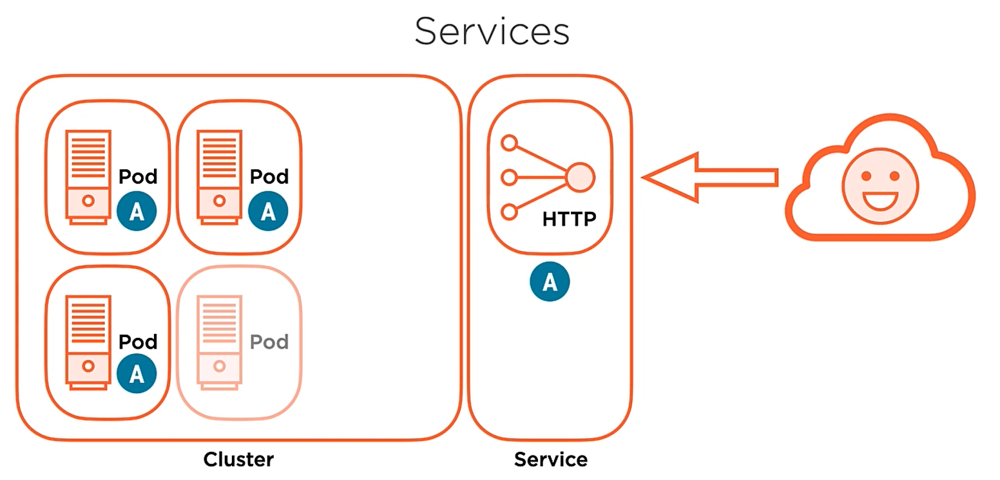
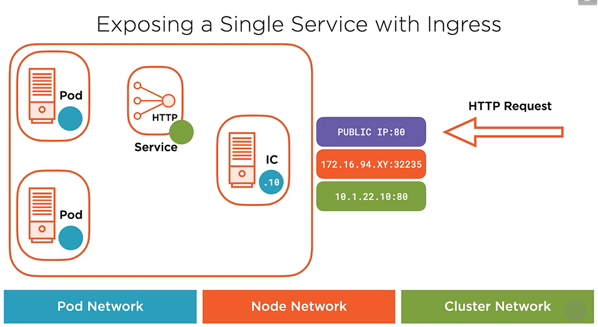

**Topics**

- Basic networking
  - Exposing a service with: ClusterIP,  NodePort, LoadBalancer
- Healthchecks
- Using Ingress
- Application upgrades - rollouts
- Manage/restrict resources
- HorizontalPodAutoscaler

# Basic networking

Kérjük le a létező nodejainkat

```bash
kubectl get nodes -o wide
```

`deployment.yaml`

```yaml
apiVersion: apps/v1
kind: Deployment
metadata:
  name: hello-world
spec:
  replicas: 3
  selector:
    matchLabels:
      app: hello-world
  template:
    metadata:
      labels:
        app: hello-world
    spec:
      containers:
      - name: hello-world
        image: nginxdemos/hello
        ports:
        - containerPort: 80
---
apiVersion: v1
kind: Service
metadata:
  name: hello-world
spec:
  selector:
    app: hello-world
  ports:
  - port: 80
    protocol: TCP
    targetPort: 80
---
```

```bash
kubectl apply -f Deployment.yaml
```

```bash
kubectl get pods -o wide
```

Lépjünk be a konténerünk shelljébe

```bash
kubectl exec -it <PODNAME> -- /bin/sh
```

Majd ott adjuk ki az alábbi parancsokat

```bash
ip a
ping <pod-a/b/c-ip>
ping <node-a/b/c-internal-ip>
```

## Service networking overview



### Service Types

Ezt a 3 beépítettet (core) ServiceType-ot fogjuk használni, de ezen felül léteznek továbbiak. Fentről lefelé ezek több
funkcionalitással bírnak, de mindegyik az előzőre épít.

  - **ClusterIP**

    A ClusterIP-service az alapértelmezett Kubernetes-service típus. Olyan szolgáltatást biztosít a node-on belül, amelyet a node-on belüli más alkalmazások is elérhetnek. Nincs külső hozzáférés.

    Ezt csak clusteren belüli kommunikációra tudjuk használni. Lényegében a publikált service-port, a
    POD-ok IP-jén lévő target-port-ra lesz mappelve, és ezek között lesz loadbalanceolva. Csak a service ip-jén
    keresztül érhetőek el a pod-ok

    ```bash
    kubectl create deployment hello-world-clusterip --image=nginxdemos/hello
    
    kubectl expose deployment hello-world-clusterip --port=80 --target-port=8080 --type ClusterIP
    
    kubectl get endpoints hello-world-clusterip
    
    kubectl scale deployment hello-world-clusterip --replicas=3
    kubectl get endpoints hello-world-clusterip
    ```

  - **NodePort**

    

    A NodePort szolgáltatás a legprimitívebb módja annak, hogy a külső forgalmat közvetlenül a szolgáltatáshoz irányítsuk. A NodePort, ahogy a neve is sugallja, megnyit egy adott portot az összes node-on (a virtuális gépeken), és az erre a portra küldött forgalom a szolgáltatáshoz kerül.

    Ami megváltozott, hogy a service-port és a target-port "közé" bekerül egy NodePort port is. Ami ebben szuper, hogy bármelyik `node-ip:node-port`-ra hívunk be, a kube-proxy a megfelelő pod(ok)-hoz fogja küldeni a kérést.

    ```bash
    kubectl create deployment hello-world-nodeport --image=nginxdemos/hello --replicas=3
    
    kubectl expose deployment hello-world-nodeport --port=80 --target-port=8080 --type NodePort
    
    kubectl get svc -o wide
    kubectl get pods -o wide
    ```

    - Pingeljük meg a kluszter belsejéből bármelyik node node-portját

  - **LoadBalancer**

    

    Itt már kapni fogunk egy publikus IP-t is, ezen keresztül már elérhetővé válik az alkalmazás a világ felé.
    
    ```bash
    kubectl create deployment hello-world-lb --image=nginxdemos/hello --replicas=3
    
    kubectl expose deployment hello-world-lb --port=80 --target-port=8080 --type LoadBalancer
    
    kubectl get svc -o wide
    kubectl get pods -o wide
    ```

# Using Ingress

Reference - https://kubernetes.io/docs/reference/kubernetes-api/service-resources/ingress-v1/

Documentation - https://kubernetes.io/docs/concepts/services-networking/ingress/




A fenti példákkal ellentétben az Ingress valójában NEM egyfajta service. Ehelyett több service előtt áll, és „intelligens útválasztóként” vagy belépési pontként működik a clusterben. Az Ingress-szel sokféle dolgot megtehetsz, és sokféle Ingress-controller létezik, amelyek különböző képességekkel rendelkeznek.

Ez lehetővé teszi az elérési út alapú és az aldomain alapú útválasztást a háttérszolgáltatásokhoz. Például mindent elküldhet a `foo.yourdomain.com` címen a `foo `szolgáltatásnak, és mindent, ami a `yourdomain.com/bar/` elérési útja alatt található a `bar `szolgáltatáshoz.

Az Ingress valószínűleg a leghatékonyabb módja annak, hogy felfedje szolgáltatásait, de lehet a legbonyolultabb is. Sokféle bemeneti vezérlő létezik, a [Google Cloud Load Balancer](https://cloud.google.com/kubernetes-engine/docs/tutorials/http-balancer), [Nginx](https://github. com/kubernetes/ingress-nginx), [Contour](https://github.com/heptio/contour), [Istio](https://istio.io/docs/tasks/traffic-management/ingress.html)  stb. Vannak beépülő modulok is az Ingress-controllerekhez, például a [cert-manager](https://github.com/jetstack/cert-manager), amelyek automatikusan SSL-tanúsítványokat biztosítanak a szolgáltatásokhoz.

Az Ingress a leghasznosabb, ha több szolgáltatást szeretnénk megjeleníteni ugyanazon az IP-címen, és ezek a szolgáltatások mindegyike ugyanazt az L7 protokollt használja (általában HTTP). Csak egy load-balancerért kell fizetni, ha a natív integrációt használja, és mivel az Ingress „okos”, sok funkciót meg tud valósítani out-of-the-box (például SSL, Auth, Routing stb.).

[Ingress-nGinx deploy docs](https://kubernetes.github.io/ingress-nginx/deploy/)

```bash
kubectl apply -f https://raw.githubusercontent.com/kubernetes/ingress-nginx/controller-v1.3.0/deploy/static/provider/cloud/deploy.yaml
```

`expose-service-w-ingress.yaml`

```yaml
# Cluster Controller
apiVersion: networking.k8s.io/v1
kind: Ingress
metadata:
  name: nginx-ingress
spec:
  ingressClassName: nginx # Az előző parancsban sok mindent létrehoztunk, ott lett megadva ez a név, itt arra hivatkozunk vissza 
  rules:
    - host: ingress-test.progmasters.hu # Amennyiben van már beállítva DNS rekordunk valahol, akkor már ezen keresztül is tudjuk használni
      http:
        paths:
          - path: /test
            pathType: Prefix
            backend:
              service:
                name: hello-srvr              # Ennek meg kell egyeznie (1)
                port:
                  number: 80                  # Ennek meg kell egyeznie (4)
  defaultBackend: # Ez egyfajta fallback kiszolgáló, ha az előzőleg specifikált rule-ok egyike sem kapja el a kérést
    service:
      name: hello-srvr                        # Ennek meg kell egyeznie (1)
      port:
        number: 80                            # Ennek meg kell egyeznie (4)
---
apiVersion: v1
kind: Service
metadata:
  name: hello-srvr                            # Ennek meg kell egyeznie (1)
spec:
  selector:
    app: hello-srvr                       	  # Ennek meg kell egyeznie (3)
  ports:
    - port: 80                                # Ennek meg kell egyeznie (4)
      targetPort: 80                          # Ennek meg kell egyeznie (5)
---
apiVersion: apps/v1
kind: Deployment
metadata:
  name: hello-srvr                            # Ennek meg kell egyeznie (3)
spec:
  selector:
    matchLabels:
      app: hello-srvr                        # Ennek meg kell egyeznie (2)
  replicas: 3
  template:
    metadata:
      labels:
        app: hello-srvr                      # Ennek meg kell egyeznie (2)
    spec:
      containers:
        - name: hello-srvr
          image: nginxdemos/hello
          ports: # Note: Ez a konténer belső portja, ezen kell futnia az alkalmazásnak
            - containerPort: 80              # Ennek meg kell egyeznie (5) 
---
```
## Ingress with TLS

https://cert-manager.io/docs/concepts/issuer/

LetsEncrypt segítségével: https://cloud.yandex.com/en-ru/docs/managed-kubernetes/tutorials/ingress-cert-manager

```bash
kubectl apply -f https://github.com/jetstack/cert-manager/releases/download/v1.4.0/cert-manager.yaml
```

`ingress-w-tls-lets-encrypt.yaml`

```yaml
# Cluster certificate issuer
apiVersion: cert-manager.io/v1
kind: ClusterIssuer
metadata:
  name: letsencrypt
  namespace: cert-manager
spec:
  acme:
    server: https://acme-v02.api.letsencrypt.org/directory # Ez az url fix, itt van a lets-encrypt API-ja
    email: magyar.attila@progmasters.hu
    privateKeySecretRef:
      name: tls-secret                     # Ennek meg kell egyeznie (6)
    solvers:
      - http01:
          ingress:
            class: nginx               # Ez előző parancsban sok mindent létrehoztunk, ott lett megadva ez a név, itt arra hivatkozunk vissza 
---
# Cluster Controller
apiVersion: networking.k8s.io/v1
kind: Ingress
metadata:
  name: nginx-ingress
  annotations:					   # Annotációk segítségével különböző extra működéssel tudjuk felruházni a resource-okat.
    nginx.ingress.kubernetes.io/rewrite-target: /
    nginx.ingress.kubernetes.io/force-ssl-redirect: "true"
    cert-manager.io/cluster-issuer: letsencrypt
spec:
  ingressClassName: nginx           # Ez előző parancsban sok mindent létrehoztunk, ott lett megadva ez a név, itt arra hivatkozunk vissza 
  tls:
    - hosts:
        - ingress.progmasters.hu
      secretName: tls-secret                 # Ennek meg kell egyeznie (6)
  rules:
    - host: ingress.progmasters.hu    # Amennyiben van már beállítva DNS rekordunk valahol, akkor már ezen keresztül is tudjuk használni
      http:
        paths:
          - path: /
            pathType: Prefix
            backend:
              service:
                name: hello-srvr                    # Ennek meg kell egyeznie (1)
                port:
                  number: 80                        # Ennek meg kell egyeznie (4)
  defaultBackend: # Ez egyfajta fallback kiszolgáló, ha az előzőleg specifikált rule-ok egyike sem kapja el a kérést
    service:
      name: hello-srvr                        # Ennek meg kell egyeznie (1)
      port:
        number: 80                            # Ennek meg kell egyeznie (4)
---
apiVersion: v1
kind: Service
metadata:
  name: hello-srvr                          # Ennek meg kell egyeznie (1)
spec:
  selector:
    app: hello-srvr                         # Ennek meg kell egyeznie (3)
  ports:
    - name: hello-http
      port: 80                              # Ennek meg kell egyeznie (4)
      targetPort: 80                        # Ennek meg kell egyeznie (5)
---
apiVersion: apps/v1
kind: Deployment
metadata:
  name: hello-srvr                          # Ennek meg kell egyeznie (3)
spec:
  selector:
    matchLabels:
      app: hello-srvr                       # Ennek meg kell egyeznie (2)
  replicas: 3
  template:
    metadata:
      labels:
        app: hello-srvr                     # Ennek meg kell egyeznie (2)
    spec:
      containers:
        - name: hello-srvr
          image: nginxdemos/hello
          ports: # Note: Ez a konténer belső portja, ezen kell futnia az alkalmazásnak
            - containerPort: 80             # Ennek meg kell egyeznie (5) 

```

```bash
kubectl apply -f ingress-w-tls-lets-encrypt.yaml
```

# Cleanup

```bash
kubectl delete -f https://raw.githubusercontent.com/kubernetes/ingress-nginx/controller-v1.3.0/deploy/static/provider/cloud/deploy.yaml
kubectl delete -f https://github.com/jetstack/cert-manager/releases/download/v1.4.0/cert-manager.yaml
kubectl delete -f ingress-w-tls-lets-encrypt.yaml
```

# Health checks - Probes

A k8s-ban definiálhatunk egy állapotellenőrzést, `Probe`-ot a Pod-ban lévő konténerhez. Ily módon a `kubelet `a `Probe` visszatérési értéke alapján határozza meg a konténer állapotát, nem pedig közvetlenül az alapján, hogy a konténer fut-e (a Container Runtime-tól *-jelen esetben Docker-* visszakapott információ). Ez biztosítja az alkalmazások egészséges fennmaradását az éles környezetben.

`healh-check-example.yaml`

```yaml
apiVersion: v1
kind: Pod
metadata:
  name: healthcheck-example
  labels:
    app: healthcheck-example
spec:
  containers:
  - name: liveness
    image: busybox
    args:
    - /bin/sh
    - -c
    - touch /tmp/healthy; sleep 30; rm -rf /tmp/healthy; sleep 600
    livenessProbe:
      exec:
        command:
        - cat
        - /tmp/healthy
      initialDelaySeconds: 5
      periodSeconds: 5
```

A fenti Pod YAML fájlban definiáltunk egy konténert, amely liveness hívásokat tartalmaz. Az első dolog, amit az indítás után tesz, az az, hogy létrehoz egy `healthy` fájlt a `/tmp `könyvtárban, jelezve, hogy az megfelelően működik. 30 másodperc elteltével törli ezt a fájlt.

Szintén definiáltunk egy `livenessProbe`-ot (healthcheck). Típusa `exec`, ami azt jelenti, hogy a konténer elindítása után egy általunk a konténerben megadott parancsot hajt végre, például `cat /tmp/healthy`. Jelenleg, ha a fájl létezik, ennek a parancsnak a visszatérési értéke 0, és a `Pod `azt gondolja, hogy a tároló nem csak elindult, hanem egészséges is. Ez az állapotellenőrzés a tároló indítása után 5 másodperccel (`initialDelaySeconds: 5`) és 5 másodpercenként (`periodSeconds: 5`) kerül végrehajtásra.

**Ellenőrzés**

```bash
kubectl create -f test-liveness-exec.yaml

kubectl get pods -w 
```

Összesen 3 féle ilyen probe-ot különböztetünk meg:

- **livenessProbe**

  Ha a Liveness Probe meghibásodik, a pod újraindul.

  use case: Indítsa újra a pod, ha a pod halott.

  best practice: Csak alapvető ellenőrzések legyenek benne. Ne függjön más szolgáltatásokhoz való kapcsolódástól. Az ellenőrzés ne tartson sokáig. 
  Mindenképpen valami lightweight, de core funkcióra épülő LivenessProbe-t használjunk, hogy akkor induljon újra a pod, ha **valóban halott**.

- **startupProbe**

  A startupProbe-ok ellenőrzik, hogy a pod elérhető-e az indítás után.

  use case: Forgalom küldése a pod-ra, amint a pod elérhető az indítás után.

  best practices: Ha a pod indítása hosszú ideig tart, adjunk meg egy startupProbe-ot.

- **readinessProbe**

  A readinessProbe a startupProbe-al ellentétben a pod teljes életciklus alatt ellenőrizni fogja, hogy a pod elérhető-e. A Liveness Probe-al ellentétben csak a pod felé irányuló forgalom áll le, ha a Readiness Probe elbukik, de nem lesz újraindítás.

  use case: Állítsa le a forgalom pod-ra küldését, ha a pod ideiglenesen nem tud kiszolgálni, mert egy másik szolgáltatáshoz (például adatbázishoz) való kapcsolat meghiúsul, és a pod később helyreáll.

  best practices: Tartalmazzon minden szükséges ellenőrzést, beleértve a más szolgáltatásokhoz való csatlakozásokat is. Ennek ellenére az ellenőrzés ne tartson túl sokáig. Mindig implementáljunk egy Readiness Probe-t, hogy megbizonyosodjunk róla, hogy a pod csak akkor kap forgalmat, ha megfelelően tudja kezelni a bejövő kéréseket.

## Healthcheck http hívás segítségével

> The diagnostic is considered successful if the response has a status code greater than or equal to 200 and less than 400.
>
> *kubernetes.io*

`health-check-w-http.yaml`

```yaml
apiVersion: apps/v1
kind: Deployment
metadata:
  name: nginx-deployment    	# Deployment neve
  labels:
    app: nginx              	# Deploymenthez adott címkék
spec:
  replicas: 1
  selector:
    matchLabels:
      app: nginx            	# Itt adhatjuk meg, hogy milyen címkéjű POD-okat kezeljünk
  template:
    metadata:
      labels:
        app: nginx          	# A POD-ok címkéi, erre mutat a 11-es sor selectora
    spec:
      containers:
        - name: nginx         	# A konténer neve a POD-on belül
          image: nginx:1.14.2
          ports:
            - name: nginx-cont-port
              containerPort: 80
      livenessProbe:
        httpGet:               	# GET kéréseket fogunk indítani a pod felé, azért, hogy ellenőrizzük annak egészségét  
          path: /			   # A base URL-re fogunk hívni
          port: 80		        # A 80-as  porton 
        initialDelaySeconds: 3
        periodSeconds: 3 
```

**Aktiválás**

```bash
kubectl apply -f health-check-w-http.yaml
```

**Ellenőrzés**

```bash
kubectl get pods -w
```

# Manage resources

## Resource Requests vs. Resource Limits

A resource requestek írják le, hogy milyen erőforrással, például CPU-val vagy RAM-mal kell rendelkeznie egy node-nak. Ha egy node nem elégíti ki a konténer kéréseit, akkor a konténer (pontosabban a pod) nem lesz ütemezve rajta. Ha egyik node sem teljesíti a kérést a clusterben, a pod egyáltalán nem lesz ütemezve.

A resource limitek pedig azt írják le, hogy egy pod mennyi erőforrást, például CPU-t vagy RAM-ot használhat fel maximum. Például, ha a resource limit 512 MB RAM-ra van állítva, a pod csak 512 MB RAM-ot tud használni, még akkor is, ha többre lenne szüksége. Ez fontos annak elkerülése érdekében, hogy a pod elakadjon, és kihasználja a node összes erőforrását. Így például elhasználva a többi pod/konténer elől. (container starvation). Ezen felül resource-limitek nélkül a Kubernetes nem tudja megoldani a pod-ok automatikus skálázását.

Értelemszerűen, a resource request sosem lehet magasabb, mint a limit.

A CPU-erőforrások millicore-ban vannak megadva. Ha a konténernek fél CPU magra van szüksége, akkor 500 m-re vagy 0,5-re definiálhatja. Később látni fogjuk, hogy a Kubernetes 0,5-öt 500 m-re konvertálja. Ügyeljünk arra, hogy soha ne kérjünl több CPU magot, mint amennyivel a legnagyobb node rendelkezik. Ellenkező esetben a K8 nem fogja tudja ütemezni a pod. Általában hatékonyabb a horizontális skálázás (több pod létrehozása), mint a nagyobb processzorteljesítmény engedélyezése. Amikor a pod eléri a CPU-korlátot, a Kubernetes lefojtja a pod-ot. Ez azt jelenti, hogy korlátozza a pod által használható CPU-t.

A memória bájtokban van meghatározva. Az alapértelmezett érték mebibyte, amely nagyjából egy megabájtnak felel meg. A bájtoktól a petabájtokig bármit beállíthatunk. Ha több RAM-ot igényel, mint amennyivel a legnagyobb node rendelkezik, a K8 soha nem fogja ütemezni a pod-ot.

A CPU-korláttól eltérően, amikor eléri a RAM-korlátot, a K8 nem tudja korlátozni a konténer memóriahasználatát. Ehelyett leállítja a pod-ot.

## Kubernetes Metrics Server

https://docs.aws.amazon.com/eks/latest/userguide/metrics-server.html

```bash
kubectl apply -f https://github.com/kubernetes-sigs/metrics-server/releases/latest/download/components.yaml
```

`pod-w-limits.yaml`

```yaml
apiVersion: v1
kind: Pod
metadata:
  name: newpod
spec:
  containers:
  - name: app
    image: images.my-company.example/app:v4
    resources:
      requests:
        memory: "64Mi"
        cpu: "250m"
      limits:
        memory: "128Mi"
        cpu: "500m"
```

**Ellenőrzés**

```bash
kubectl apply -f pod-w-limits.yaml
```

Próbáljuk ki mi történik, ha túl magas értékeket állítunk be a requesthez!

Miután beállítottuk az erőforráskorlátokat, erősen ajánlott, hogy folyamatosan figyeljük azokat, hogy megbizonyosodjunk róla, a limitek nincsenek alábecsülve, mert ez rontani fogja a teljesítményt. A másik véglet, ha túlbecsüljük a határokat, feleslegesen túl sok erőforrást engedélyezünk, és elfoglaljuk a többi pod elől.

# HorizontalPodAutoscaler

> A HPA ebben a formában csak 1.23-as Kubernetestől működik. AWS-en 1.22 van, Azure-nél már 1.24

Ahogy a neve is sugallja, a HPA skálázza a pod-replikák számát. A legtöbb esetben CPU-t és memóriát használunk triggerként a több-kevesebb pod-replikák számának beállításához. De beállíthatjuk úgy is, hogy egyéni, több, vagy akár külső metrikák alapján skálázzunk.

```yaml
apiVersion: autoscaling/v2
kind: HorizontalPodAutoscaler
metadata:
  name: custom-hpa
spec:
  scaleTargetRef:			# Itt határozhatjuk meg, hogy pontosan mit is szeretnénk skálázni
    kind: Deployment
    name: my-deployment		# Itt egy deploymentünket nevét kell megadjuk
  minReplicas: 1		    # Minimum mennyi pod-nak kell léteznie, ha csökken a terhelés, ez alá akkor sem fog menni
  maxReplicas: 10			# Maximum pod-ok száma
  targetCPUUtilizationPercentage: 50 # Ez a sor
  metrics:						   # Illetve itt a metrics, és az alá tartozó konfiguráció ugyanazt csinálja
  - type: Resource
    resource:
      name: cpu
      target:
        type: Utilization
        averageUtilization: 50
  targetMemoryUtilizationPercentage: 80 # Mint feljebb, csak memóriával    
```

Fontos, hogy a különböző metrikák között VAGY kapcsolat van, ha valamelyik miatt felfelé kell skálázni, akkor fog. Lefelé viszont csak akkor fog, ha egyik sem haladja meg az értékeket. Itt okos a működése, nem fog 49 és 79-nél lejjebb skálázni, van a háttérben pár egyszerű algoritmus, ami kiszámolja az optimális mennyiséget.

# Application upgrades

Az egyik előnye a deploymenteknek a pod-ok vezérlésére, a rolling updatek végrehajtásának lehetősége. A rolling update lehetővé teszi a pod-ok konfigurációjának fokozatos frissítését, és számos lehetőséget kínálnak ennek a folyamatnak a vezérlésére.

A beállítások legfontosabb eleme, a stratégia. A deployment leírásban a `spec.strategy.type`-nak két változata van:

- **RollingUpdate**: Az új podokat fokozatosan adja hozzá, és a régieket pedig fokozatosan megszünteti
- **Recreate**: Az összeset törli, majd létrehozza az újakat. 

A legtöbb esetben a RollingUpdate az előnyben részesített stratégia. A Recreate akkor lehet hasznos, ha egy pod-ot solo-ban futtatunk, és nem fogadható el, hogy akár néhány másodpercre is több legyen belőle.

A RollingUpdate stratégia használatakor további két lehetőség van a frissítési folyamat finomhangolására:

- **maxSurge:** A podok maximális száma a replicaSeten felül, az update során.
- **maxUnavailable:** A nem elérhető podok maximális száma az update során.

Ezt mindenképpen érdemes kombinálni egy readinessProbe-bal, ilyenkor az updatelési folyamat be fogja várni, hogy készen álljon a pod.

`update-strategies.yaml`

```yaml
apiVersion: apps/v1
kind: Deployment
metadata:
  name: nginx-deployment    	# Deployment neve
  labels:
    app: nginx              	# Deploymenthez adott címkék
spec:
  replicas: 3
  strategy:					   # Itt állíthatjuk be az update stratégiánkat
    type: RollingUpdate
    rollingUpdate:
      maxSurge: 1
      maxUnavailable: 0
  selector:
    matchLabels:
      app: nginx            	# Itt adhatjuk meg, hogy milyen címkéjű POD-okat kezeljünk
  template:
    metadata:
      labels:
        app: nginx          	# A POD-ok címkéi, erre mutat a 11-es sor selectora
    readinessProbe:
      periodSeconds: 10		  	# 10 mp-enként fog futni egy check
      initialDelaySeconds: 2    # Legalább 2 mp-et fogunk várni az első check előtt
      timeoutSeconds: 2		   	# Ha a kérés több mint 2mp-ig tart, a check elbukik	
      httpGet:
        path: /
        port: 80
    spec:
      containers:
        - name: nginx         	# A konténer neve a POD-on belül
          image: nginx:1.14.2
          ports:
            - containerPort: 80
```

**Aktiválás**

```bash
kubectl apply -f update-strategies.yaml
```

**Ellenőrzés**

```bash
kubectl get pods -o wide
kubectl get deploy -o wide
```

Ezután változtassuk meg az nginx-image verzióját `1.14.2`-ről `1.16.1`-re. Majd ezt is élesítsük!

Ezután, az alábbi paranccsal ellenőrizhetjük ezeknek a rollout-oknak a history-ját.

```bash
kubectl rollout history deployment/nginx-deployment  
```

Ha valami hiba csúszott a dologba, és vissza szeretnénk állni előző állapotra, akkor ezt több féle képpen is megtehetjük:

- Egyszerűen csak állítsuk vissza a `.yaml` fájlunkat, és élesítsük.

- A rollout history-nk segítségével görgessük vissza az előző állapotokat!

  Ennek a parancsnak a segítségével vissza tudunk állni a közvetlen előző állapotra

  ```bash
  kubectl rollout undo deployment/nginx-deployment
  ```

  Vagy, a következővel egy konkrét `revision`-re

  ```bash
  kubectl rollout undo deployment/nginx-deployment --to-revision=1
  ```

**Fontos!**
A deployment "rollout"-ja akkor és csak akkor fog triggerelődni, ha a deployment.template része (azaz `.spec.template`) módosul. Ha módosítjuk a méretezési paramétereket stb, akkor az nem történik meg.

# See also

https://kubernetes.io/docs/concepts/services-networking/service/#publishing-services-service-types

https://kubernetes.io/docs/tasks/administer-cluster/manage-resources/

https://kubernetes.io/docs/tasks/run-application/horizontal-pod-autoscale-walkthrough/

https://kubernetes.io/docs/reference/kubernetes-api/workload-resources/horizontal-pod-autoscaler-v2/

https://learnk8s.io/kubernetes-rollbacks
